# Automate Infrastructure With IaC using Terraform part 1
-------

In project 15, we were able to build AWS infrastructure for 2 websites manually. In this project 16, we will be automating this process using `IAC` tool known as `Terraform`.

## What is Terraform ?

Terraform is an open-source tool from HashiCorp that lets you manage infrastructure using code. You write configurations in a simple language called HCL to describe what your infrastructure should look like, and Terraform takes care of creating and managing those resources. It works with many cloud providers like AWS, Azure, and Google Cloud. With Terraform, you can plan changes before applying them, ensuring everything is set up correctly. It also keeps track of the current state of your infrastructure, making updates and scaling easier. In short, Terraform makes it easy to automate and manage your cloud infrastructure efficiently and consistently.

[read-more](https://www.terraform.io)

## Prerequisites before you begin writing Terraform code

1. ***`Create an IAM user, name it terraform (ensure that the user has only programatic access to your AWS account) and grant this user AdministratorAccess permissions. to do this :`***

    * sign in to `AWS management console`, navigate to `IAM` ( Identity and Access Management)
    * Select `Users` at the left panel and click on `Create user`
    * Follow the process to create a new user
    * To ensure programmatic access ( that is access to aws via AWS CLI ) , select the newly created user and click on the security tab.
    * Copy the secret access key and access key ID. Save them in a notepad temporarily.

2. ***`Install AWS CLI for Ubuntu 24.04`***

    ```bash
    sudo apt update

    # Ensure snapd is Installed

    sudo apt install snapd

    # Install AWS CLI Using Snap

    sudo snap install aws-cli --classic

    # Verify the Installation

    aws --version
   `
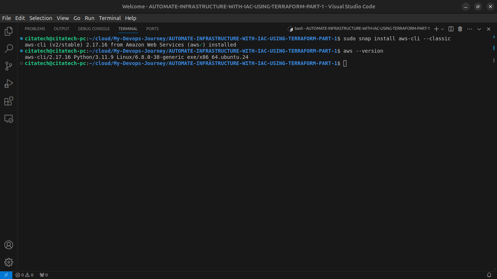

[*`click here for instructions to install AWS CLI on other OS`*]( https://docs.aws.amazon.com/cli/latest/userguide/getting-started-install.html )

3. `Configure AWS CLI in the terminal`

   ```bash
   aws configure

* Follow the prompt, by inputing your access key id, access key and region and press enter.

4. `Install Boto3 (Boto3 is a AWS SDK for Python)`
    To install Boto3, you will need to create a virtual environment ( this is because my OS is ubuntu 24.04 )

    * `First , ensure python is installed `
        ```bash
        sudo apt install python3 python3-venv python3-pip

    * `Create a Virtual Environment inside your project directory`
         ```bash
         python3 -m venv venv
    * `Activate the virtual environment`
        ```bash
        source venv/bin/activate
    * You should see `(venv)` prefixed to your termainal prompt, indicating that the virtual environment is active.
    * Install `boto3` Within the Virtual Environment
        ```bash
        pip install boto3

    

5. `Terraform must store state about your managed infrastructure and configuration. This state is used by Terraform to map real world resources to your configuration, keep track of metadata, and to improve performance for large infrastructures.`

    This state is stored by default in a local file named "terraform.tfstate", but it can also be stored remotely, which works better in a team environment.

6. `Create a S3 bucket resource to store terraform state remotely.   `

    * Type `S3` in search bar in aws management console
    * Click on create bucket
    * Enter a Bucket name, AWS Region, Enable Bucket Versioning, Add a Tag and click create bucket.

    
    
    

    * You can also verfiy this in the AWS CLI
        ```bash
        aws s3 ls
    


## Install terraform

To install `terraform` on Ubuntu 24.04, follow the steps below :

    wget -O- https://apt.releases.hashicorp.com/gpg | sudo gpg --dearmor -o /usr/share/keyrings/hashicorp-archive-keyring.gpg

    echo "deb [signed-by=/usr/share/keyrings/hashicorp-archive-keyring.gpg] https://apt.releases.hashicorp.com $(lsb_release -cs) main" | sudo tee /etc/apt/sources.list.d/hashicorp.list

    sudo apt update 

    sudo apt install terraform

Confirm installation 
        
        terraform --version


## VPC | Subnets | Security Groups

Let us create a directory structure

1. Open your Visual Studio Code and create a folder called PBL
2. Create a file in the folder, name it main.tf

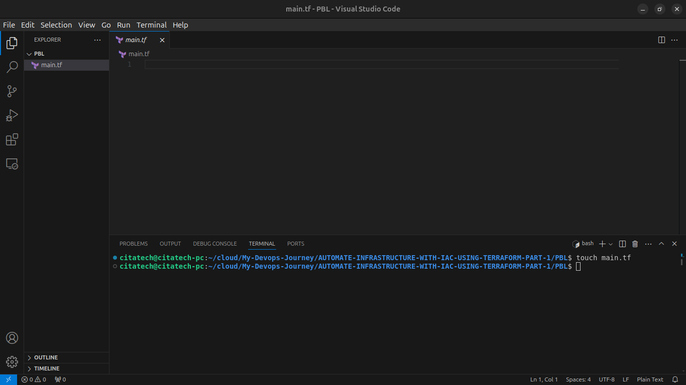

### VPC resource section

3. Add AWS as a provider, and a resource to create a VPC in the main.tf file. The provider block informs Terraform that we intend to build infrastructure within AWS.
* Resource block will create a VPC.

     ```bash
        provider "aws" {
        region = "eu-central-1"
        }

        # Create VPC
        resource "aws_vpc" "main" {
        cidr_block                     = "172.16.0.0/16"
        enable_dns_support             = "true"
        enable_dns_hostnames           = "true"
        }

    Note: You can change the configuration above to create your VPC in other region that is closer to you. The same applies to all configuration snippets that will follow.

4. The next thing we need to do, is to download necessary plugins for Terraform to work. These plugins are used by providers and provisioners. At this stage, we only have `provider` in our `main.tf`file. So, Terraform will just download plugin for AWS provider.
Navigate to the PBL folder


5. Let's verify what terraform intends to create , 

        terraform plan


If all looks Okay, you can go ahead to run it , you can use the command below : \

        terraform apply


### Subnets resource section

According to our architectural design, 6 subnets are required:

* 2 public subnets
* 2 private subnets for webservers
* 2 private subnets for data layer

6. Let us create the first 2 public subnets.Add below configuration to the main.tf file:

    ```bash
        # Create public subnets1
        resource "aws_subnet" "public1" {
        vpc_id                     = aws_vpc.main.id
        cidr_block                 = "172.16.0.0/24"
        map_public_ip_on_launch    = true
        availability_zone          = "eu-central-1a"


        }


        # Create public subnet2
        resource "aws_subnet" "public2" {
        vpc_id                     = aws_vpc.main.id
        cidr_block                 = "172.16.1.0/24"
        map_public_ip_on_launch    = true
        availability_zone          = "eu-central-1b"
        }

7. Run `terraform plan` to check the intending infrusture and `terraform apply` to create the infrusture.

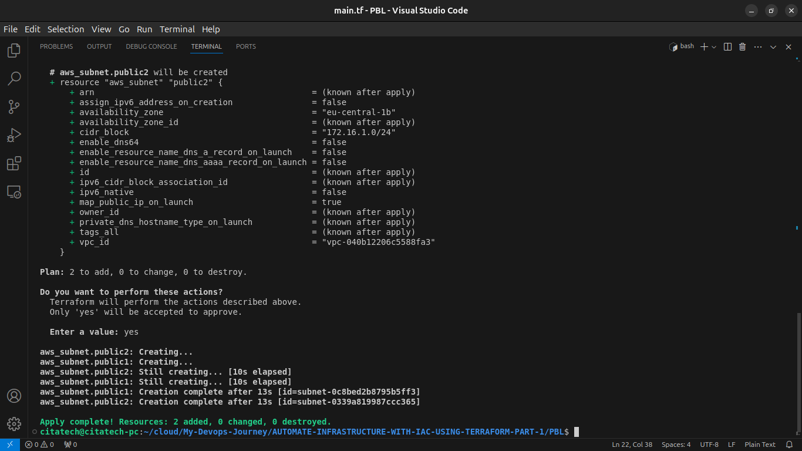


8. Verify Vpc in aws management console

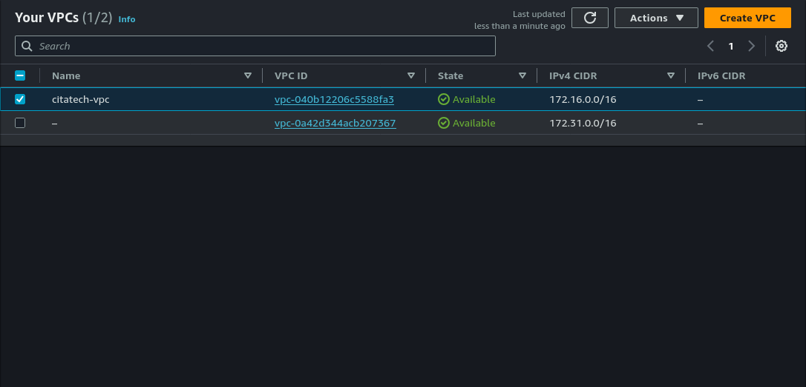

9. Verify subnets in aws management console


However, this process is not dynamic and can become tideous when working with huge infrastructures. We need to optimize this by introducing a count argument and refactoring our code.

10. First, destroy the current infrastructure. Since we are still in development, this is totally fine. Otherwise, `DO NOT DESTROY` an infrastructure that has been deployed to production.
* To destroy whatever has been created run `terraform destroy` command, and type yes after evaluating the plan.

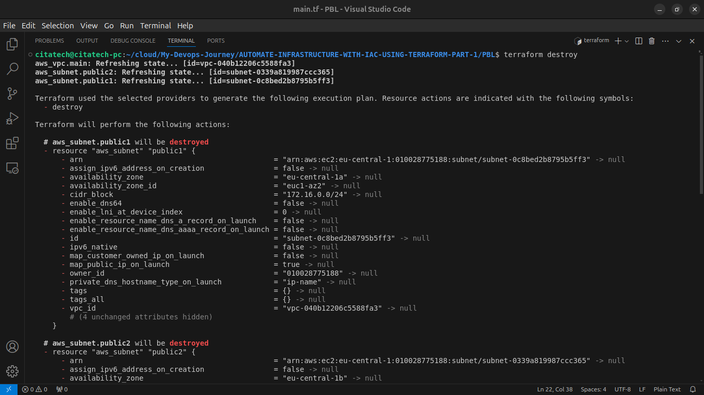


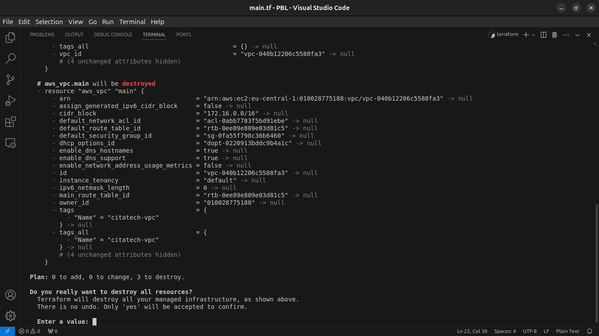

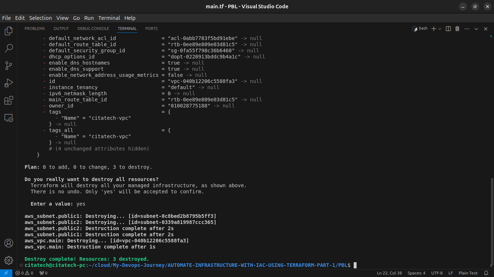


### Fixing The Problems By Code Refactoring

As stated ealier, while the code above worked fine, the process is inefficient and not dynamic. Some o :f the problems we will be solving includes the following

- Fixing Hard Coded Values
- Fixing multiple resource blocks
- Let’s make cidr_block dynamic

*`Fixing the Hard Coded Values`*

- We will introduce variables, and remove hard coding.

- Starting with the `provider` block, declare a `variable` named `region`, give it a default value (if you don't declare a default value, you will be prompted each time you run terraform plan/apply), and update the provider section by referring to the declared variable.
    ```bash
        variable "region" {
        default = "eu-central-1"
             }

        provider "aws" {
            region = var.region
        }
 
 - Do the same to cidr value in the vpc block, and all the other arguments.
    ```bash
         variable "vpc_cidr" {
        default = "172.16.0.0/16"
         }


        variable "enable_dns_support" {
            default = "true"
        }


        variable "enable_dns_hostnames" {
            default ="true" 
        }

        variable "preferred_number_of_public_subnets" {
        default = 2
        }

        # Create VPC
        resource "aws_vpc" "main" {
        cidr_block                     = var.vpc_cidr
        enable_dns_support             = var.enable_dns_support 
        enable_dns_hostnames           = var.enable_dns_support
        enable_classiclink             = var.enable_classiclink
        enable_classiclink_dns_support = var.enable_classiclink

        }

*`Fixing multiple resource blocks`*

- Terraform has a functionality that allows us to pull data which exposes information to us. Terraform’s Data Sources helps us to fetch information outside of Terraform. In this case, from AWS.

- Let us fetch Availability zones from AWS, and replace the hard coded value in the subnet’s availability_zone section.\

   ```bash
       # Get list of availability zones

       data "aws_availability_zones" "available" {
       state = "available"
        }

- To make use of this new data resource, we will need to introduce a count argument in the subnet block: Something like this

    ```bash
        # Create public subnet
        resource "aws_subnet" "public" { 
        count                   = 2
        vpc_id                  = aws_vpc.main.id
        cidr_block              = "172.16.1.0/24"
        map_public_ip_on_launch = true
        availability_zone       = data.aws_availability_zones.available.names[count.index]

         }

However, the cidr_block needs to be dynamic and this can be achieved by introducing the function `cidrsubnet() ` which accepts three parameter - `cidrsubnet(prefix, newbits, netnum)`

- The `prefix` parameter must be given in CIDR notation, same as for VPC.
- The `newbits` parameter is the number of additional bits with which to extend the prefix. For example, if given a prefix ending with /16 and a newbits value of 4, the resulting subnet address will have length /20
- The -  parameter is a whole number that can be represented as a binary integer with no more than newbits binary digits, which will be used to populate the additional bits added to the prefix

`NOTE: You can experiment how this works by entering the terraform console and keep changing the figures to see the output.`

* On the terminal, run `terraform console`
* type `cidrsubnet("172.16.0.0/16", 4, 0)`
* Hit enter.
* See the output.
* Keep changing the numbers and see what happens.
* To get out of the console, `type exit`.

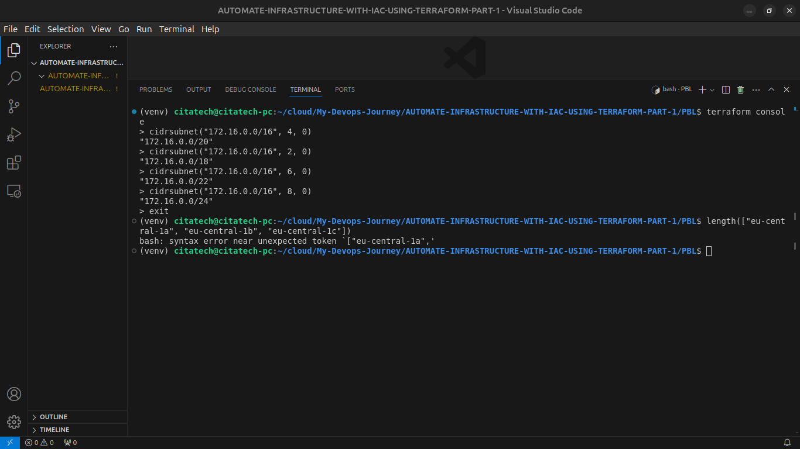


- The snippet below would now replace the 2 resource blocks we created earlier. As well this single code snippet can create mulitiply subnets by just replacing the `count` value accordingly.

    ```bash
        # Create public subnet
        resource "aws_subnet" "public" { 
        count                   = 2
        vpc_id                  = aws_vpc.main.id
        cidr_block              = cidrsubnet(var.vpc_cidr, 4 , count.index)
        map_public_ip_on_launch = true
        availability_zone       = data.aws_availability_zones.available.names[count.index]

        }

*`Removing hard coded count value.`*

- Additionally, instead of hard coding the count value, we can use the `length()`, create variable and set a default value for count.

- Since data.aws_availability_zones.available.names returns a list like ["eu-central-1a", "eu-central-1b", "eu-central-1c"] we can pass it into a lenght function and get number of the AZs.
`length(["eu-central-1a", "eu-central-1b", "eu-central-1c"])`

- Open up terraform console and try it

    


    ```bash
    # Create public subnets
    resource "aws_subnet" "public" {
    count  = var.preferred_number_of_public_subnets == null ? length(data.aws_availability_zones.available.names) : var.preferred_number_of_public_subnets   
    vpc_id = aws_vpc.main.id
    cidr_block              = cidrsubnet(var.vpc_cidr, 4 , count.index)
    map_public_ip_on_launch = true
    availability_zone       = data.aws_availability_zones.available.names[count.index]

    }

### Observations:

- What we have now, is sufficient to create the subnet resource required. But if you observe, it is not satisfying our business requirement of just 2 subnets. The length function will return number 3 to the count argument, but what we actually need is 2.

- Now, let us fix this. Declare a variable to store the desired number of public subnets, and set the default value

     ```bash
        variable "preferred_number_of_public_subnets" {
        default = 2
        }

- Next, update the count argument with a condition. Terraform needs to check first if there is a desired number of subnets. Otherwise, use the data returned by the length function. See how that is presented below.

    ```bash
    # Create public subnets
    resource "aws_subnet" "public" {
    count  = var.preferred_number_of_public_subnets == null ? length(data.aws_availability_zones.available.names) : var.preferred_number_of_public_subnets  

    vpc_id = aws_vpc.main.id
    cidr_block              = cidrsubnet(var.vpc_cidr, 4 , count.index)

    map_public_ip_on_launch = true
    availability_zone       = data.aws_availability_zones.available.names[count.index]
        }


Now lets break it down:

* The first part var.preferred_number_of_public_subnets == null checks if the value of the variable is set to null or has some value defined.
* The second part ? and length(data.aws_availability_zones.available.names) means, if the first part is true, then use this. In other words, if preferred number of public subnets is null (Or not known) then set the value to the data returned by lenght function.
* The third part : and var.preferred_number_of_public_subnets means, if the first condition is false, i.e preferred number of public subnets is not null then set the value to whatever is defined in var.preferred_number_of_public_subnets Now the entire configuration should now look like this:

    ```bash
    
     # Get list of availability zones
        data "aws_availability_zones" "available" {
        state = "available"
        }


        variable "region" {
            default = "eu-central-1"
        }


        variable "vpc_cidr" {
            default = "172.16.0.0/16"
        }


        variable "enable_dns_support" {
            default = "true"
        }


        variable "enable_dns_hostnames" {
            default ="true" 
        }


        variable "enable_classiclink" {
            default = "false"
        }


        variable "enable_classiclink_dns_support" {
            default = "false"
        }


        variable "preferred_number_of_public_subnets" {
            default = 2
        }


        provider "aws" {
        region = var.region
        }


        # Create VPC
        resource "aws_vpc" "main" {
        cidr_block                     = var.vpc_cidr
        enable_dns_support             = var.enable_dns_support 
        enable_dns_hostnames           = var.enable_dns_support
        enable_classiclink             = var.enable_classiclink
        enable_classiclink_dns_support = var.enable_classiclink


        }


        # Create public subnets
        resource "aws_subnet" "public" {
        count  = var.preferred_number_of_public_subnets == null ? length(data.aws_availability_zones.available.names) : var.preferred_number_of_public_subnets   
        vpc_id = aws_vpc.main.id
        cidr_block              = cidrsubnet(var.vpc_cidr, 4 , count.index)
        map_public_ip_on_launch = true
        availability_zone       = data.aws_availability_zones.available.names[count.index]

        }

### Introducing variables.tf & terraform.tfvars

Instead of having a long list of variables in main.tf file, we can actually make our code a lot more readable and better structured by moving out some parts of the configuration content to other files. We will put all variable declarations in a separate file and provide non default values to each of them.

* Create a new file and name it `variables.tf`. Copy all the variable declarations into the new file.
* Create another file, name it `terraform.tfvars`. Set values for each of the variables.

### main.tf

- 
    ```bash
    # Get list of availability zones
    data "aws_availability_zones" "available" {
    state = "available"
    }


    provider "aws" {
    region = var.region
    }


    # Create VPC
    resource "aws_vpc" "main" {
    cidr_block           = var.vpc_cidr
    enable_dns_support   = var.enable_dns_support 
    enable_dns_hostnames = var.enable_dns_support
    }

    # Create public subnets
    resource "aws_subnet" "public" {
    count  = var.preferred_number_of_public_subnets == null ? length(data.aws_availability_zones.available.names) : var.preferred_number_of_public_subnets   
    vpc_id = aws_vpc.main.id
    cidr_block              = cidrsubnet(var.vpc_cidr, 4 , count.index)
    map_public_ip_on_launch = true
    availability_zone       = data.aws_availability_zones.available.names[count.index]
    }


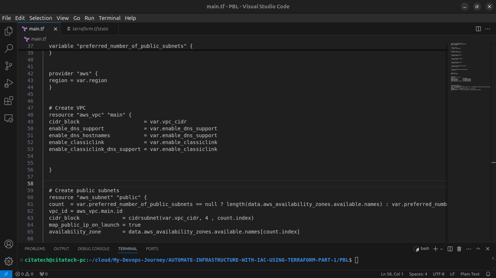


### variables.tf

- 
    ```bash 
    variable "region" {
    default = "eu-central-1"
    }


    variable "vpc_cidr" {
        default = "172.16.0.0/16"
    }


    variable "enable_dns_support" {
        default = "true"
    }


    variable "enable_dns_hostnames" {
        default ="true" 
    }


    variable "enable_classiclink" {
        default = "false"
    }


    variable "enable_classiclink_dns_support" {
        default = "false"
    }

    variable "preferred_number_of_public_subnets" {
        default = null
    }


### terraform.tfvars

- 
    ```bash
    region = "eu-central-1"


    vpc_cidr = "172.16.0.0/16" 


    enable_dns_support = "true" 


    enable_dns_hostnames = "true"  


    enable_classiclink = "false" 


    enable_classiclink_dns_support = "false" 


    preferred_number_of_public_subnets = 2

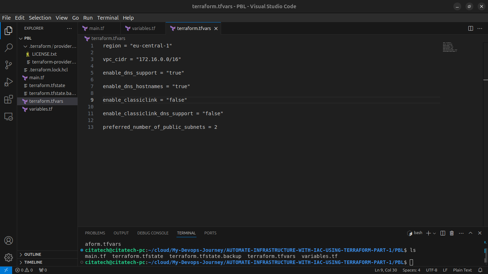

#### terraform plan


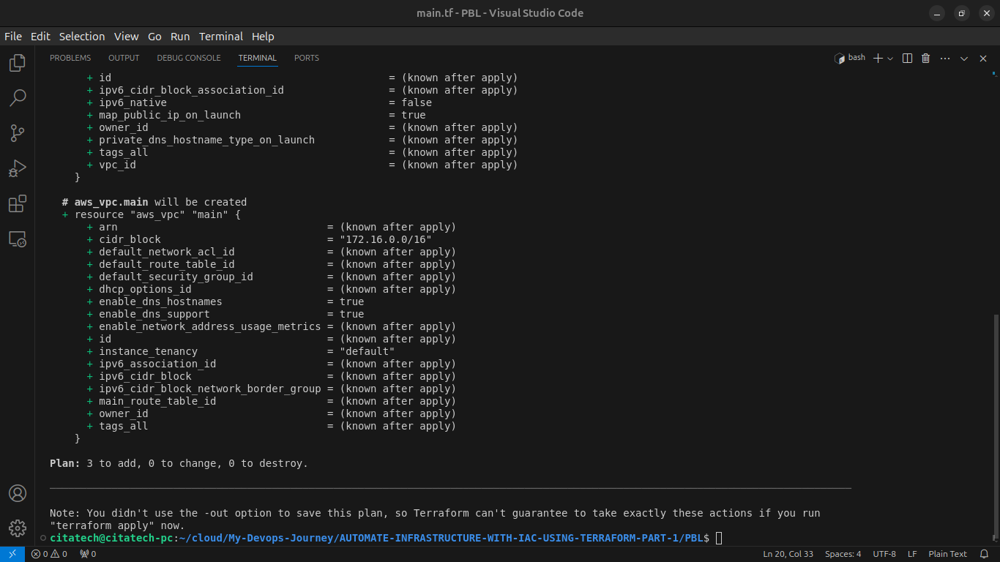


#### terraform apply

run `terraform apply` to create tyhe infrastructures


#### Destroy the Infrastructures

Use the command `terraform destroy` to terminate all infrastructures


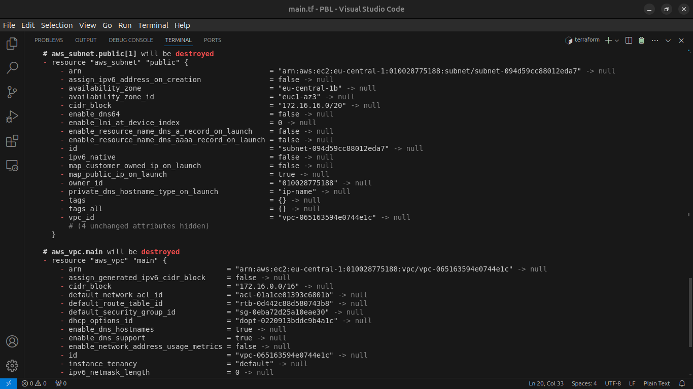


