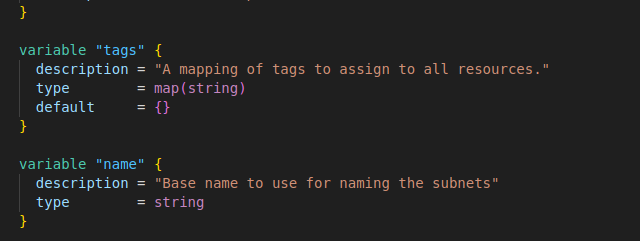
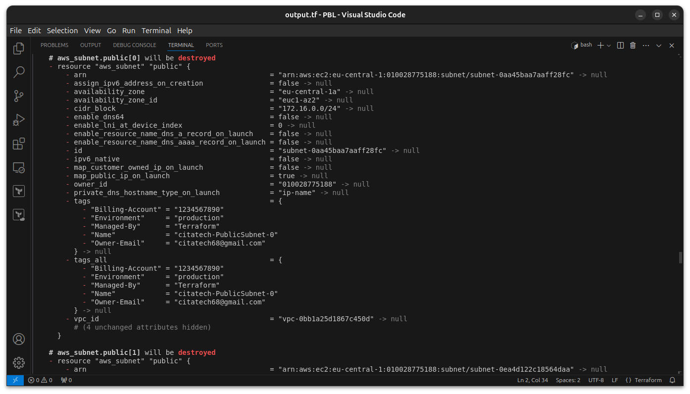
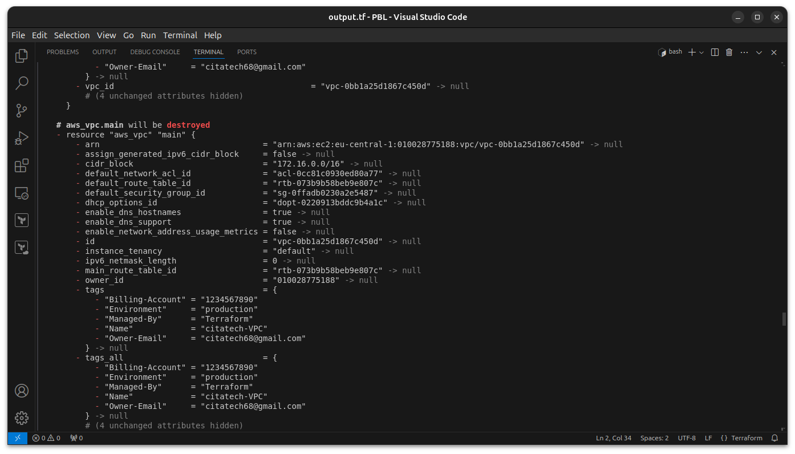
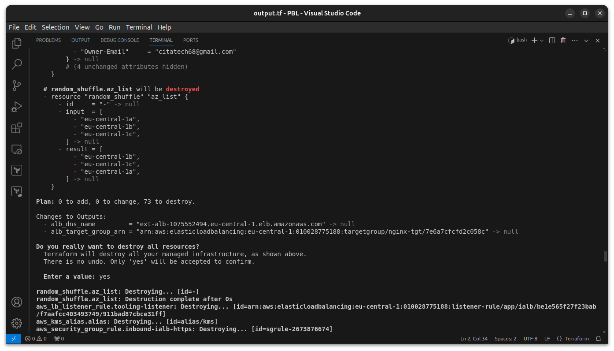
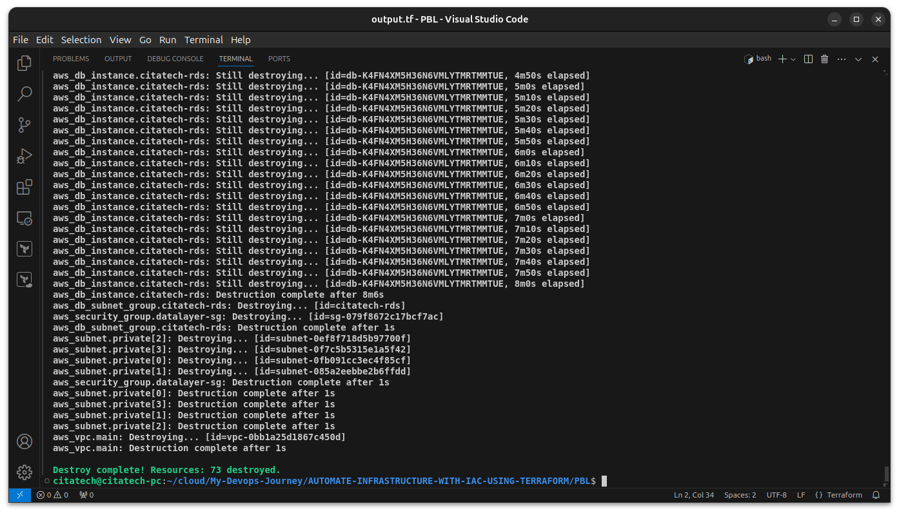

## AUTOMATE-INFRASTRUCTURE-WITH-IAC-USING-TERRAFORM-PART-2

This is a continuation from the previous project 16. Here , we will need to set up `subnets` just like what we did in earlier manually.

### Networking - Private subnets & best practices

* Create 4 private subnets keeping in mind following principles:
    * Make sure you use variables or length() function to determine the number of AZs.
    * Use variables and cidrsubnet() function to allocate vpc_cidr for subnets.
    * Keep variables and resources in separate files for better code structure and readability.
    * Tag all the resources you have created so far. Explore how to use format() and count functions to automatically tag subnets with its respective number.

Note: You can add multiple tags as a default set. for example, in out terraform.tfvars file we can have default tags defined.

        
        tags = {
        Environment      = "production" 
        Owner-Email     = "chidiaustin78@gmail.com"
        Managed-By      = "Terraform"
        Billing-Account = "1234567890"
            }
Now you can tag all you resources using the format below
        
        tags = merge(
            var.tags,
            {
            Name = "Name of the resource"
            },
        )


NOTE: Update the variables.tf to declare the variable tags used in the format above;

        variable "tags" {
        description = "A mapping of tags to assign to all resources."
        type        = map(string)
        default     = {}
        }

        variable "name" {
        description = "Base name to use for naming the subnets"
        type        = string
        }



Anytime we need to make a change to the tags, we simply do that in one single place (terraform.tfvars). But, our key-value pairs are hard coded. So, go ahead and work out a fix for that. Simply create variables for each value and use var.variable_name as the value to each of the keys.

### Internet Gateways & format() function

        resource "aws_internet_gateway" "ig" {
        vpc_id = aws_vpc.main.id

        tags = merge(
            var.tags,
            {
            Name = format("%s-%s", aws_vpc.main.id, "IG")
            }
        )
        }

The format() functionis used to dynamically generate a unique name for this resource - 
The first part of the %s takes the interpolated value of aws_vpc.main.id while the second %s appends a literal string IG and finally an exclamation mark is added in the end. If any of the resources being created is either using the count function, or creating multiple resources using a loop, then a key-value pair that needs to be unique must be handled differently. For example, each of our subnets should have a unique name in the tag section. Without the format() function, we would not be able to see uniqueness. With the format function, each private subnet’s tag will look like this.

        Name = PrvateSubnet-0
        Name = PrvateSubnet-1
        Name = PrvateSubnet-2

### NAT Gateways

* Create 1 NAT Gateway and 1 Elastic IP (EIP) address
* Create the NAT Gateways in a new file called nat_gateway.tf.

Note: We need to create an Elastic IP for the NAT Gateway, and you can see the use of depends_on to indicate that the Internet Gateway resource must be available before this should be created. Although Terraform does a good job to manage dependencies, but in some cases, it is good to be explicit. You can read more on dependencies here

        resource "aws_eip" "nat_eip" {
        domain = "vpc"
        depends_on = [aws_internet_gateway.ig]

        tags = merge(
            var.tags,
            {
            Name = format("%s-EIP", var.name)
            },
        )
        }

        resource "aws_nat_gateway" "nat" {
        allocation_id = aws_eip.nat_eip.id
        subnet_id     = element(aws_subnet.public.*.id, 0)
        depends_on    = [aws_internet_gateway.ig]

        tags = merge(
            var.tags,
            {
            Name = format("%s-Nat", var.name)
            },
        )
        }

### AWS Routes

* Create a file called route_tables.tf and use it to create routes for both public and private subnets, create the below resources. Ensure they are properly tagged.
    * aws_route_table
    * aws_route
    * aws_route_table_association

        ```bash
        # create private route table
        resource "aws_route_table" "private-rtb" {
        vpc_id = aws_vpc.main.id

        tags = merge(
            var.tags,
            {
            Name = format("%s-Private-Route-Table", var.name)
            },
        )
        }

        # associate all private subnets to the private route table
        resource "aws_route_table_association" "private-subnets-assoc" {
        count          = length(aws_subnet.private[*].id)
        subnet_id      = element(aws_subnet.private[*].id, count.index)
        route_table_id = aws_route_table.private-rtb.id
        }

        # create route table for the public subnets
        resource "aws_route_table" "public-rtb" {
        vpc_id = aws_vpc.main.id

        tags = merge(
            var.tags,
            {
            Name = format("%s-Public-Route-Table", var.name)
            },
        )
        }

        # create route for the public route table and attach the internet gateway
        resource "aws_route" "public-rtb-route" {
        route_table_id         = aws_route_table.public-rtb.id
        destination_cidr_block = "0.0.0.0/0"
        gateway_id             = aws_internet_gateway.ig.id
        }

        # associate all public subnets to the public route table
        resource "aws_route_table_association" "public-subnets-assoc" {
        count          = length(aws_subnet.public[*].id)
        subnet_id      = element(aws_subnet.public[*].id, count.index)
        route_table_id = aws_route_table.public-rtb.id
        }

Now if you run terraform plan and terraform apply it will add the following resources to AWS in multi-az set up:

    – Our main vpc
    – 2 Public subnets
    – 4 Private subnets
    – 1 Internet Gateway
    – 1 NAT Gateway
    – 1 EIP
    – 2 Route tables

Now, we are done with Networking part of AWS set up, let us move on to Compute and Access Control configuration automation using Terraform!

### IAM and Roles

Lets pass an IAM role to our EC2 instances to give them access to some specific resources, so we need to do the following:

1. Create AssumeRole : Assume Role uses Security Token Service (STS) API that returns a set of temporary security credentials that you can use to access AWS resources that you might not normally have access to. These temporary credentials consist of an access key ID, a secret access key, and a security token. Typically, you use AssumeRole within your account or for cross-account access.

Add the following code to a new file named `roles.tf`

     
        resource "aws_iam_role" "ec2_instance_role" {
        name = "ec2_instance_role"
        assume_role_policy = jsonencode({
            Version = "2012-10-17"
            Statement = [
            {
                Action = "sts:AssumeRole"
                Effect = "Allow"
                Sid    = ""
                Principal = {
                Service = "ec2.amazonaws.com"
                }
            },
            ]
        })
        
        tags = merge(
            var.tags,
            {
            Name = "aws assume role"
            },
        )
        }

 In above code we are creating AssumeRole with AssumeRole policy. It is granting EC2, permissions to assume the role.

2. Create IAM policy for this role: This is where we need to define a required policy (i.e., permissions) according to our requirements. For example, allowing an IAM role to perform action describe applied to EC2 instances:


        resource "aws_iam_policy" "policy" {
        name        = "ec2_instance_policy"
        description = "A test policy"
        policy = jsonencode({
            Version = "2012-10-17"
            Statement = [
            {
                Action = [
                "ec2:Describe*",
                ]
                Effect   = "Allow"
                Resource = "*"
            },
            ]

        })

        tags = merge(
            var.tags,
            {
            Name =  "aws assume policy"
            },
        )

        }

3. Attach the Policy to the IAM Role: This is where, we will be attaching the policy which we created above, to the role we created in the first step.

    ```bash
         resource "aws_iam_role_policy_attachment" "test-attach" {
        role       = aws_iam_role.ec2_instance_role.name
        policy_arn = aws_iam_policy.policy.arn
            }

        #Create an Instance Profile and interpolate the IAM Role
            resource "aws_iam_instance_profile" "ip" {
                name = "aws_instance_profile_test"
                role =  aws_iam_role.ec2_instance_role.name
            }

### Create Security Groups

* Create all the security groups in a single file, then we are going to reference this security group within each resources that needs it. IMPORTANT: Check out the terraform documentation for [security group](https://registry.terraform.io/providers/hashicorp/aws/latest/docs/resources/security_group) Check out the terraform documentation for [security group rule](https://registry.terraform.io/providers/hashicorp/aws/latest/docs/resources/security_group_rule)

Create a file and name it security.tf, copy and paste the code below

    
            # security group for alb, to allow access from any where for HTTP and HTTPS traffic
                resource "aws_security_group" "ext-alb-sg" {
                name        = "ext-alb-sg"
                vpc_id      = aws_vpc.main.id
                description = "Allow TLS inbound traffic"


                ingress {
                    description = "HTTP"
                    from_port   = 80
                    to_port     = 80
                    protocol    = "tcp"
                    cidr_blocks = ["0.0.0.0/0"]
                }


                ingress {
                    description = "HTTPS"
                    from_port   = 22
                    to_port     = 22
                    protocol    = "tcp"
                    cidr_blocks = ["0.0.0.0/0"]
                }


                ingress {
                    from_port   = 0
                    to_port     = 0
                    protocol    = "-1"
                    cidr_blocks = ["0.0.0.0/0"]
                }


                tags = merge(
                    var.tags,
                    {
                    Name = "ext-alb-sg"
                    },
                )


                }


                # security group for bastion, to allow access into the bastion host from you IP
                resource "aws_security_group" "bastion_sg" {
                name        = "vpc_web_sg"
                vpc_id = aws_vpc.main.id
                description = "Allow incoming HTTP connections."


                ingress {
                    description = "SSH"
                    from_port   = 22
                    to_port     = 22
                    protocol    = "tcp"
                    cidr_blocks = ["0.0.0.0/0"]
                }


                egress {
                    from_port   = 0
                    to_port     = 0
                    protocol    = "-1"
                    cidr_blocks = ["0.0.0.0/0"]
                }


                tags = merge(
                    var.tags,
                    {
                    Name = "Bastion-SG"
                    },
                )
                }


                #security group for nginx reverse proxy, to allow access only from the extaernal load balancer and bastion instance
                resource "aws_security_group" "nginx-sg" {
                name   = "nginx-sg"
                vpc_id = aws_vpc.main.id


                egress {
                    from_port   = 0
                    to_port     = 0
                    protocol    = "-1"
                    cidr_blocks = ["0.0.0.0/0"]
                }


                tags = merge(
                    var.tags,
                    {
                    Name = "nginx-SG"
                    },
                )
                }


                resource "aws_security_group_rule" "inbound-nginx-http" {
                type                     = "ingress"
                from_port                = 443
                to_port                  = 443
                protocol                 = "tcp"
                source_security_group_id = aws_security_group.ext-alb-sg.id
                security_group_id        = aws_security_group.nginx-sg.id
                }


                resource "aws_security_group_rule" "inbound-bastion-ssh" {
                type                     = "ingress"
                from_port                = 22
                to_port                  = 22
                protocol                 = "tcp"
                source_security_group_id = aws_security_group.bastion_sg.id
                security_group_id        = aws_security_group.nginx-sg.id
                }


                # security group for ialb, to have acces only from nginx reverser proxy server
                resource "aws_security_group" "int-alb-sg" {
                name   = "my-alb-sg"
                vpc_id = aws_vpc.main.id


                egress {
                    from_port   = 0
                    to_port     = 0
                    protocol    = "-1"
                    cidr_blocks = ["0.0.0.0/0"]
                }


                tags = merge(
                    var.tags,
                    {
                    Name = "int-alb-sg"
                    },
                )


                }


                resource "aws_security_group_rule" "inbound-ialb-https" {
                type                     = "ingress"
                from_port                = 443
                to_port                  = 443
                protocol                 = "tcp"
                source_security_group_id = aws_security_group.nginx-sg.id
                security_group_id        = aws_security_group.int-alb-sg.id
                }


                # security group for webservers, to have access only from the internal load balancer and bastion instance
                resource "aws_security_group" "webserver-sg" {
                name   = "my-asg-sg"
                vpc_id = aws_vpc.main.id


                egress {
                    from_port   = 0
                    to_port     = 0
                    protocol    = "-1"
                    cidr_blocks = ["0.0.0.0/0"]
                }


                tags = merge(
                    var.tags,
                    {
                    Name = "webserver-sg"
                    },
                )


                }


                resource "aws_security_group_rule" "inbound-web-https" {
                type                     = "ingress"
                from_port                = 443
                to_port                  = 443
                protocol                 = "tcp"
                source_security_group_id = aws_security_group.int-alb-sg.id
                security_group_id        = aws_security_group.webserver-sg.id
                }


                resource "aws_security_group_rule" "inbound-web-ssh" {
                type                     = "ingress"
                from_port                = 22
                to_port                  = 22
                protocol                 = "tcp"
                source_security_group_id = aws_security_group.bastion_sg.id
                security_group_id        = aws_security_group.webserver-sg.id
                }


                # security group for datalayer to alow traffic from websever on nfs and mysql port and bastion host on mysql port
                resource "aws_security_group" "datalayer-sg" {
                name   = "datalayer-sg"
                vpc_id = aws_vpc.main.id


                egress {
                    from_port   = 0
                    to_port     = 0
                    protocol    = "-1"
                    cidr_blocks = ["0.0.0.0/0"]
                }


                tags = merge(
                    var.tags,
                    {
                    Name = "datalayer-sg"
                    },
                )
                }


                resource "aws_security_group_rule" "inbound-nfs-port" {
                type                     = "ingress"
                from_port                = 2049
                to_port                  = 2049
                protocol                 = "tcp"
                source_security_group_id = aws_security_group.webserver-sg.id
                security_group_id        = aws_security_group.datalayer-sg.id
                }


                resource "aws_security_group_rule" "inbound-mysql-bastion" {
                type                     = "ingress"
                from_port                = 3306
                to_port                  = 3306
                protocol                 = "tcp"
                source_security_group_id = aws_security_group.bastion_sg.id
                security_group_id        = aws_security_group.datalayer-sg.id
                }


                resource "aws_security_group_rule" "inbound-mysql-webserver" {
                type                     = "ingress"
                from_port                = 3306
                to_port                  = 3306
                protocol                 = "tcp"
                source_security_group_id = aws_security_group.webserver-sg.id
                security_group_id        = aws_security_group.datalayer-sg.id
                }
                
IMPORTANT NOTE: We used the aws_security_group_rule to reference another security group in a security group.

### Certificate From Amazon Certificate Manager

* Create cert.tf file and add the following code snippets to it.

NOTE: Read Through to change the domain name to your own domain name and every other name that needs to be changed.

Check out the terraform documentation for [AWS Certificate manager](https://registry.terraform.io/providers/hashicorp/aws/latest/docs/resources/acm_certificate)

The entire section create a certificate, public zone, and validate the certificate using DNS method. Create the certificate using a wildcard for all the domains created in `citatech.online`.

NOTE: You'd have to create a hosted zone from the AWS management console first before making reference to the created hosted zone in the code below;


        data "aws_route53_zone" "citatech" {
        name         = "citatech.online"
        private_zone = false
        }

        resource "aws_acm_certificate" "citatech" {
        domain_name       = "*.citatech.online"
        validation_method = "DNS"
        }

        resource "aws_route53_record" "citatech" {
        for_each = {
         for dvo in aws_acm_certificate.citatech.domain_validation_options : dvo.domain_name => {
            name   = dvo.resource_record_name
            record = dvo.resource_record_value
            type   = dvo.resource_record_type
            }
        }

          allow_overwrite = true
            name            = each.value.name
            records         = [each.value.record]
            ttl             = 60
            type            = each.value.type
            zone_id         = data.aws_route53_zone.citatech.zone_id
            }

            resource "aws_acm_certificate_validation" "citatech" {
            certificate_arn         = aws_acm_certificate.citatech.arn
            validation_record_fqdns = [for record in aws_route53_record.citatech : record.fqdn]
            }

            resource "aws_route53_record" "tooling" {
            zone_id = data.aws_route53_zone.citatech.zone_id
            name    = "tooling.citatech.online"
            type    = "A"

            alias {
                name                   = aws_lb.ext-alb.dns_name
                zone_id                = aws_lb.ext-alb.zone_id
                evaluate_target_health = true
            }
            }

            resource "aws_route53_record" "wordpress" {
            zone_id = data.aws_route53_zone.citatech.zone_id
            name    = "wordpress.citatech.online"
            type    = "A"

            alias {
                name                   = aws_lb.ext-alb.dns_name
                zone_id                = aws_lb.ext-alb.zone_id
                evaluate_target_health = true
            }
            }

You can run `terraform plan` and `terraform apply` , check that the resources are created , then run `terraform destroy` to destroy all resources 


### External (Internet facing) Application Load Balancer (ALB)


* Create a file called alb.tf 
* Create the ALB, then we create the target group and lastly we will create the listener rule. Useful Terraform Documentation, go through this documentation and understand the argument needed for each resources: ALB, ALB-target and ALB-listener. The ALB will balance the traffic between the Instances:

            resource "aws_lb" "ext-alb" {
            name     = "ext-alb"
            internal = false
            security_groups = [
                aws_security_group.ext-alb-sg.id,
            ]

            subnets = [
                aws_subnet.public[0].id,
                aws_subnet.public[1].id
            ]

            tags = merge(
                var.tags,
                {
                Name = "ACS-ext-alb"
                },
            )

            ip_address_type    = "ipv4"
            load_balancer_type = "application"
            }


* Inform our ALB to where route the traffic. So, create a Target Group to point to its targets:

            resource "aws_lb_target_group" "nginx-tgt" {
            health_check {
                interval            = 10
                path                = "/healthstatus"
                protocol            = "HTTPS"
                timeout             = 5
                healthy_threshold   = 5
                unhealthy_threshold = 2
            }
            name        = "nginx-tgt"
            port        = 443
            protocol    = "HTTPS"
            target_type = "instance"
            vpc_id      = aws_vpc.main.id
            }

* Create a Listener for this target Group

            resource "aws_lb_listener" "nginx-listner" {
            load_balancer_arn = aws_lb.ext-alb.arn
            port              = 443
            protocol          = "HTTPS"
            certificate_arn   = aws_acm_certificate_validation.citatech.certificate_arn

            default_action {
                type             = "forward"
                target_group_arn = aws_lb_target_group.nginx-tgt.arn
            }
            }

* Add the following outputs to output.tf to print them on screen.

            output "alb_dns_name" {
            value = aws_lb.ext-alb.dns_name
            }

            output "alb_target_group_arn" {
            value = aws_lb_target_group.nginx-tgt.arn
            }

### Internal (Internal) Application Load Balancer (ALB)

For the Internal Load balancer, follow the same concepts with the external load balancer.

Add the code snippets inside the alb.tf file.

            resource "aws_lb" "ialb" {
            name     = "ialb"
            internal = true
            security_groups = [
                aws_security_group.int-alb-sg.id,
            ]

            subnets = [
                aws_subnet.private[0].id,
                aws_subnet.private[1].id
            ]

            tags = merge(
                var.tags,
                {
                Name = "citatech-int-alb"
                },
            )

            ip_address_type    = "ipv4"
            load_balancer_type = "application"
            }

* To inform our ALB to where route the traffic we need to create a Target Group to point to its targets:

    ```bash
            # --- target group  for wordpress -------

            resource "aws_lb_target_group" "wordpress-tgt" {
            health_check {
                interval            = 10
                path                = "/healthstatus"
                protocol            = "HTTPS"
                timeout             = 5
                healthy_threshold   = 5
                unhealthy_threshold = 2
            }

            name        = "wordpress-tgt"
            port        = 443
            protocol    = "HTTPS"
            target_type = "instance"
            vpc_id      = aws_vpc.main.id
            }


            # --- target group for tooling -------

            resource "aws_lb_target_group" "tooling-tgt" {
            health_check {
                interval            = 10
                path                = "/healthstatus"
                protocol            = "HTTPS"
                timeout             = 5
                healthy_threshold   = 5
                unhealthy_threshold = 2
            }

            name        = "tooling-tgt"
            port        = 443
            protocol    = "HTTPS"
            target_type = "instance"
            vpc_id      = aws_vpc.main.id
            }

* Create a Listener for this target Group

 For this aspect a single listener was created for the wordpress which is default, A rule was created to route traffic to tooling when the host header changes

            resource "aws_lb_listener" "web-listener" {
            load_balancer_arn = aws_lb.ialb.arn
            port              = 443
            protocol          = "HTTPS"
            certificate_arn   = aws_acm_certificate_validation.citatech.certificate_arn


            default_action {
                type             = "forward"
                target_group_arn = aws_lb_target_group.wordpress-tgt.arn
            }
            }

            # listener rule for tooling target

            resource "aws_lb_listener_rule" "tooling-listener" {
            listener_arn = aws_lb_listener.web-listener.arn
            priority     = 99

            action {
                type             = "forward"
                target_group_arn = aws_lb_target_group.tooling-tgt.arn
            }

            condition {
                host_header {
                values = ["tooling.citatech.online"]
                }
            }
            }

### Auto Scaling Group (ASG)

We need to configure our ASG to be able to scale the EC2s out and in depending on the application traffic. Before we start configuring an ASG, we need to create the launch template and the the AMI needed. For now we are going to use a random AMI from AWS, then in project 19, we will use Packer to create our ami. Based on our Architecture we need Auto Scaling Groups for bastion, nginx, wordpress and tooling, so we will create two files; asg-bastion-nginx.tf will contain Launch Template and Autoscaling group for Bastion and Nginx, then asg-wordpress-tooling.tf will contain Launch Template and Autoscaling group for wordpress and tooling.

1. Create asg-bastion-nginx.tf and paste all the code snippet below;

            # creating sns topic for all the auto scaling groups
            resource "aws_sns_topic" "citatech-sns" {
            name = "Default_CloudWatch_Alarms_Topic"
            }


            # creating notification for all the auto scaling groups
            resource "aws_autoscaling_notification" "citatech_notifications" {
            group_names = [
            aws_autoscaling_group.bastion-asg.name,
            aws_autoscaling_group.nginx-asg.name,
            aws_autoscaling_group.wordpress-asg.name,
            aws_autoscaling_group.tooling-asg.name,
            ]
            notifications = [
            "autoscaling:EC2_INSTANCE_LAUNCH",
            "autoscaling:EC2_INSTANCE_TERMINATE",
            "autoscaling:EC2_INSTANCE_LAUNCH_ERROR",
            "autoscaling:EC2_INSTANCE_TERMINATE_ERROR",
            ]

            topic_arn = aws_sns_topic.citatech-sns.arn
            }


            resource "random_shuffle" "az_list" {
            input        = data.aws_availability_zones.available.names
            }


            # launch template for bastion

            resource "aws_launch_template" "bastion-launch-template" {
            image_id               = var.ami
            instance_type          = "t2.small"
            vpc_security_group_ids = [aws_security_group.bastion_sg.id]

            iam_instance_profile {
            name = aws_iam_instance_profile.ip.id
            }

            key_name = var.keypair

            placement {
            availability_zone = "random_shuffle.az_list.result"
            }

            lifecycle {
            create_before_destroy = true
            }

            tag_specifications {
            resource_type = "instance"

            tags = merge(
            var.tags,
            {
                Name = "bastion-launch-template"
            },
            )
            }


            # create a file called bastion.sh and copy the bastion userdata from project 15 into it
            user_data = filebase64("${path.module}/bastion.sh")
            }


            # ---- Autoscaling for bastion  hosts


            resource "aws_autoscaling_group" "bastion-asg" {
            name                      = "bastion-asg"
            max_size                  = 2
            min_size                  = 1
            health_check_grace_period = 300
            health_check_type         = "ELB"
            desired_capacity          = 1

            vpc_zone_identifier = [
            aws_subnet.public[0].id,
            aws_subnet.public[1].id
            ]


            launch_template {
            id      = aws_launch_template.bastion-launch-template.id
            version = "$Latest"
            }
            tag {
            key                 = "Name"
            value               = "bastion-launch-template"
            propagate_at_launch = true
            }

            }


            # launch template for nginx

            resource "aws_launch_template" "nginx-launch-template" {
            image_id               = var.ami
            instance_type          = "t2.small"
            vpc_security_group_ids = [aws_security_group.nginx-sg.id]

            iam_instance_profile {
            name = aws_iam_instance_profile.ip.id
            }

            key_name =  var.keypair

            placement {
            availability_zone = "random_shuffle.az_list.result"
            }

            lifecycle {
            create_before_destroy = true
            }

            tag_specifications {
            resource_type = "instance"

            tags = merge(
            var.tags,
            {
                Name = "nginx-launch-template"
            },
            )
            }

            # create a file called nginx.sh and copy the nginx userdata from project 15 into it
            user_data = filebase64("${path.module}/nginx.sh")
            }


            # ------ Autoscslaling group for reverse proxy nginx ---------

            resource "aws_autoscaling_group" "nginx-asg" {
            name                      = "nginx-asg"
            max_size                  = 2
            min_size                  = 1
            health_check_grace_period = 300
            health_check_type         = "ELB"
            desired_capacity          = 1

            vpc_zone_identifier = [
            aws_subnet.public[0].id,
            aws_subnet.public[1].id
            ]

            launch_template {
            id      = aws_launch_template.nginx-launch-template.id
            version = "$Latest"
            }

            tag {
            key                 = "Name"
            value               = "nginx-launch-template"
            propagate_at_launch = true
            }


            }

            # attaching autoscaling group of nginx to external load balancer
            resource "aws_autoscaling_attachment" "asg_attachment_nginx" {
            autoscaling_group_name = aws_autoscaling_group.nginx-asg.id
            lb_target_group_arn   = aws_lb_target_group.nginx-tgt.arn
            }


2. Autoscaling for wordpress and tooling will be created in a separate file

* Create asg-wordpress-tooling.tf and paste the following code

            # launch template for wordpress

            resource "aws_launch_template" "wordpress-launch-template" {
            image_id               = var.ami
            instance_type          = "t2.small"
            vpc_security_group_ids = [aws_security_group.webserver-sg.id]

            iam_instance_profile {
                name = aws_iam_instance_profile.ip.id
            }

            key_name = var.keypair


            placement {
                availability_zone = "random_shuffle.az_list.result"
            }

            lifecycle {
                create_before_destroy = true
            }

            tag_specifications {
                resource_type = "instance"

                tags = merge(
                var.tags,
                {
                Name = "wordpress-launch-template"
                },
            )

            }
            
                # create a file called wordpress.sh and copy the wordpress userdata from project 15 into it.
            user_data = filebase64("${path.module}/wordpress.sh")
            }


            # ---- Autoscaling for wordpress application

            resource "aws_autoscaling_group" "wordpress-asg" {
            name                      = "wordpress-asg"
            max_size                  = 2
            min_size                  = 1
            health_check_grace_period = 300
            health_check_type         = "ELB"
            desired_capacity          = 1
            vpc_zone_identifier = [

                aws_subnet.private[0].id,
                aws_subnet.private[1].id
            ]


            launch_template {
                id      = aws_launch_template.wordpress-launch-template.id
                version = "$Latest"
            }
            tag {
                key                 = "Name"
                value               = "wordpress-asg"
                propagate_at_launch = true
            }
            }


            # attaching autoscaling group of wordpress application to internal loadbalancer
            resource "aws_autoscaling_attachment" "asg_attachment_wordpress" {
            autoscaling_group_name = aws_autoscaling_group.wordpress-asg.id
            lb_target_group_arn   = aws_lb_target_group.wordpress-tgt.arn
            }


            # launch template for tooling
            resource "aws_launch_template" "tooling-launch-template" {
            image_id               = var.ami
            instance_type          = "t2.small"
            vpc_security_group_ids = [aws_security_group.webserver-sg.id]

            iam_instance_profile {
                name = aws_iam_instance_profile.ip.id
            }

            key_name = var.keypair


            placement {
                availability_zone = "random_shuffle.az_list.result"
            }

            lifecycle {
                create_before_destroy = true
            }

            tag_specifications {
                resource_type = "instance"

            tags = merge(
                var.tags,
                {
                Name = "tooling-launch-template"
                },
            )

            }
            
            # create a file called tooling.sh and copy the tooling userdata from project 15 into it
            user_data = filebase64("${path.module}/tooling.sh")
            }


            # ---- Autoscaling for tooling -----

            resource "aws_autoscaling_group" "tooling-asg" {
            name                      = "tooling-asg"
            max_size                  = 2
            min_size                  = 1
            health_check_grace_period = 300
            health_check_type         = "ELB"
            desired_capacity          = 1

            vpc_zone_identifier = [

                aws_subnet.private[0].id,
                aws_subnet.private[1].id
            ]

            launch_template {
                id      = aws_launch_template.tooling-launch-template.id
                version = "$Latest"
            }

            tag {
                key                 = "Name"
                value               = "tooling-launch-template"
                propagate_at_launch = true
            }
            }

            # attaching autoscaling group of  tooling application to internal loadbalancer
            resource "aws_autoscaling_attachment" "asg_attachment_tooling" {
            autoscaling_group_name = aws_autoscaling_group.tooling-asg.id
            lb_target_group_arn   = aws_lb_target_group.tooling-tgt.arn
            }


### Elastic File System (EFS)

In order to create an EFS you need to create a KMS key. AWS Key Management Service (KMS) makes it easy for you to create and manage cryptographic keys and control their use across a wide range of AWS services and in your applications.

Add the following code to efs.tf

            resource "aws_kms_key" "citatech-kms" {
            description = "KMS key "
            policy      = <<EOF
            {
            "Version": "2012-10-17",
            "Id": "kms-key-policy",
            "Statement": [
                {
                "Sid": "Enable IAM User Permissions",
                "Effect": "Allow",
                "Principal": { "AWS": "arn:aws:iam::010028775188:user/leoken" },
                "Action": "kms:*",
                "Resource": "*"
                }
            ]
            }
            EOF
            }

            # create key alias
            resource "aws_kms_alias" "alias" {
            name          = "alias/kms"
            target_key_id = aws_kms_key.citatech-kms.key_id
            }

Let us create EFS and it mount targets- add the following code to efs.tf

            # create Elastic file system
            resource "aws_efs_file_system" "citatech-efs" {
            encrypted  = true
            kms_key_id = aws_kms_key.citatech-kms.arn

            tags = merge(
                var.tags,
                {
                Name = "citatech-efs"
                },
            )
            }


            # set first mount target for the EFS 
            resource "aws_efs_mount_target" "subnet-1" {
            file_system_id  = aws_efs_file_system.citatech-efs.id
            subnet_id       = aws_subnet.private[0].id
            security_groups = [aws_security_group.datalayer-sg.id]
            }


            # set second mount target for the EFS 
            resource "aws_efs_mount_target" "subnet-2" {
            file_system_id  = aws_efs_file_system.citatech-efs.id
            subnet_id       = aws_subnet.private[1].id
            security_groups = [aws_security_group.datalayer-sg.id]
            }

            # create access point for wordpress
            resource "aws_efs_access_point" "wordpress" {
            file_system_id = aws_efs_file_system.citatech-efs.id

            posix_user {
                gid = 0
                uid = 0
            }

            root_directory {
                path = "/wordpress"

                creation_info {
                owner_gid   = 0
                owner_uid   = 0
                permissions = 0755
                }

            }

            }

            # create access point for tooling
            resource "aws_efs_access_point" "tooling" {
            file_system_id = aws_efs_file_system.citatech-efs.id
            posix_user {
                gid = 0
                uid = 0
            }

            root_directory {

                path = "/tooling"

                creation_info {
                owner_gid   = 0
                owner_uid   = 0
                permissions = 0755
                }

            }
            }

### MySQL RDS

Create the RDS itself using this snippet of code in rds.tf file:

            # create DB subnet group from the private subnets
            resource "aws_db_subnet_group" "citatech-rds" {
            name       = "citatech-rds"
            subnet_ids = [aws_subnet.private[2].id, aws_subnet.private[3].id]

            tags = merge(
                var.tags,
                {
                Name = "citatech-rds"
                },
            )
            }

            # create the RDS instance with the subnets group
            resource "aws_db_instance" "citatech-rds" {
            allocated_storage      = 20
            storage_type           = "gp2"
            engine                 = "mysql"
            engine_version         = "5.7"
            instance_class         = "db.t2.small"
            db_name                = "citatechdb"
            username               = var.master-username
            password               = var.master-password
            parameter_group_name   = "default.mysql5.7"
            db_subnet_group_name   = aws_db_subnet_group.citatech-rds.name
            skip_final_snapshot    = true
            vpc_security_group_ids = [aws_security_group.datalayer-sg.id]
            multi_az               = "true"
            }

Declare the variables in our resources that has not been declared in the variables.tf file.

                variable "ami" {
                type        = string
                description = "AMI ID for the launch template"
                }


                variable "keypair" {
                type        = string
                description = "key pair for the instances"
                }


                variable "account_no" {
                type        = number
                description = "the account number"
                }


                variable "master-username" {
                type        = string
                description = "RDS admin username"
                }


                variable "master-password" {
                type        = string
                description = "RDS master password"
                }

* Run a `terraform init -upgrade` > `terraform plan` > `terraform apply`


* Don't forget to terraform destroy the resources to avoid cost.  `terraform destroy -auto-approve`












