### AWS-CLOUD-SOLUTION-FOR-2-COMPANY-WEBSITES-USING-A-REVERSE-PROXY-TECHNOLOGY
------
#### General Overview

You will create a secure infrastructure within AWS VPC (Virtual Private Cloud) for a fictional company named Citatech. This infrastructure will support Citatech's main business website, which uses the WordPress Content Management System (CMS), as well as a Tooling Website (PHP/MySQL) for their DevOps team. To enhance security and performance, the company has decided to implement NGINX reverse proxy technology. The project prioritizes cost-efficiency, security, and scalability. The goal is to develop an architecture that ensures both the WordPress and Tooling websites are resilient to web server failures, can handle increased traffic, and maintain reasonable costs.

### Requirements
There are few requirements that must be met before you begin:

1. Properly configure your AWS account and Organization Unit 
    * Create an AWS Master account. (Also known as Root Account)
    * Within the Root account, create a sub-account and name it DevOps. (You will need another email address to complete this)

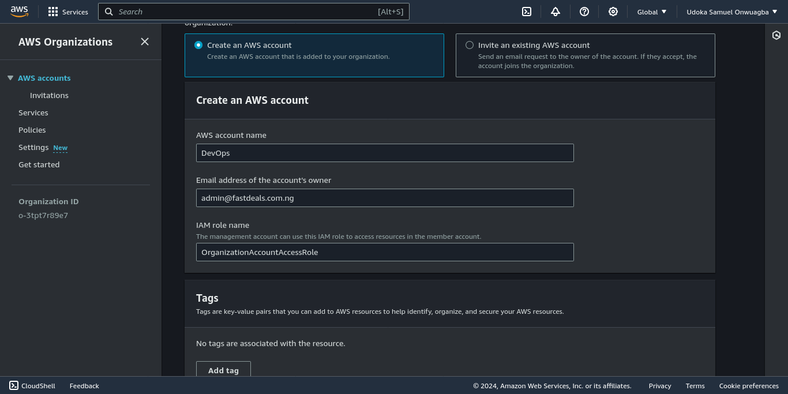

   * Login to the newly created AWS account using the new email address.
     
2. Create a domain name for your company. I used [Hostinger](https://www.hostinger.com/).
3. Create a hosted zone in AWS, and map it to your domain. to do this ,
   * On your AWS console search bar, type `route 53` and click on it, > select `create hosted zones`

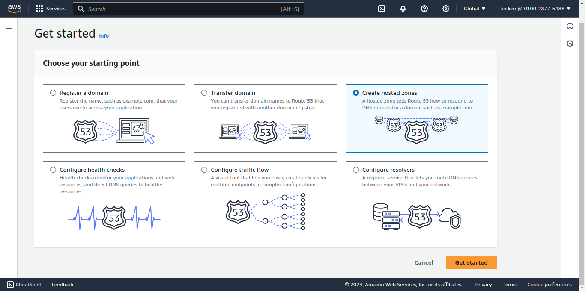    

   * Set your already purchased domain name, and set the type o public hosted zone, click on `create hosted zone`
   * copy the namservers and go back to your domain management , and add the nameservers, allow it sometime to propagate, usually between few hours to a day

 ### SET UP A VIRTUAL PRIVATE CLOUD (VPC)

 --------
1. Create a VPC

   

2. Create the subnets as shown in the Architecture

   P.S :  Use this website to get the CIDR blocks easily. [ipinfo](https://ipinfo.io/ips).

  

3. Create a route table and associate it with public subnets. to do this ,
     * on the side vpc dashboard side medu, click on `route tables` > `create route table`
     * Associate Public subnet to the Public route table. Click the tab `Actions` >  `edit subnet associations` - select the subnets and click `save associations`

  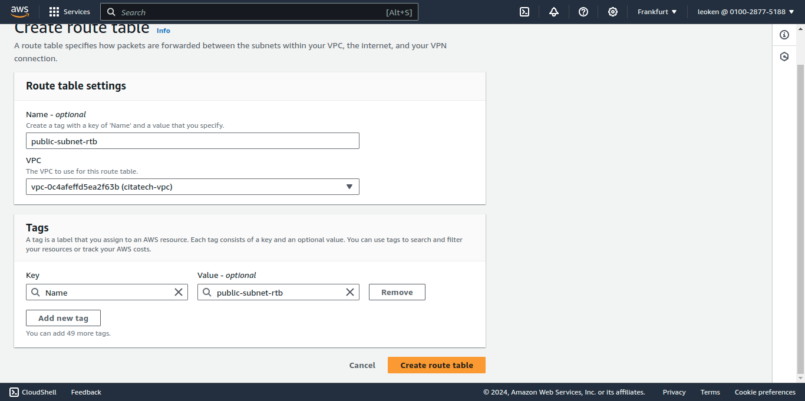
  
  
 
4. Create a route table and associate it with private subnets. to do this
     * Repeat same process as step 3 above

  

  

  

5. Create internet gateway as shown in the architecture.and attach it to the VPC

  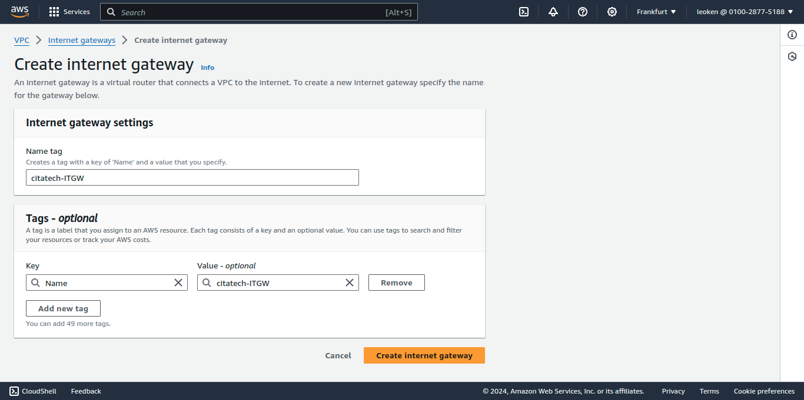

  Next, attach the internet gateway to the VPC we created earlier.
  On the same page click `Attach to VPC`, select the vpc and click `attach internet gateway`

  
  

6. Edit a route in public route table, and associate it with the Internet Gateway. (This is what allows a public subnet to be accessible from the Internet).To achieve this,
      * Select the public route table we created, the click on `actions` > `edit route`
  
   
  

7. Create Elastic IP to configured with the NAT gateway. The NAT gateway enables connection from the public subnet to private subnet and it needs a static ip to make this         happen.`VPC` > `Elastic IP addresses` > `Allocate Elastic IP address` - add a name tag and click on `allocate`

  

8. Create a Nat Gateway and assign the Elastic IPs
    Click on `VPC` > `NAT gateways` > `Create NAT gateway`

   - Select a Public Subnet
   - Connection Type: Public
   - Allocate Elastic IP
  
9. Update the Private route table - add allow anywhere ip and associate it the NAT gateway.

   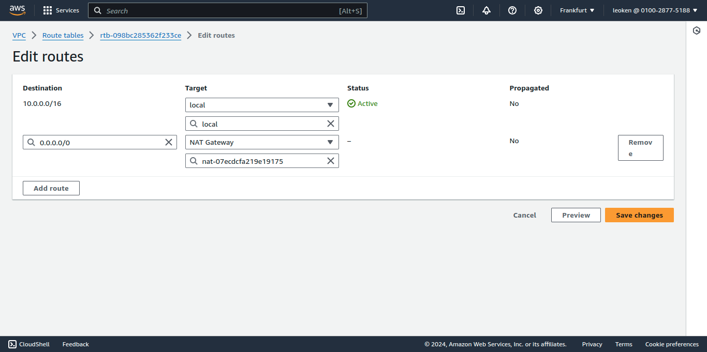

10. Create a Security Group for the following

   - `Nginx Servers`: Access to Nginx should only be allowed from a Application Load balancer (ALB). At this point, we have not created a load balancer, therefore we will          update the rules later. For now, just create it and put some dummy records as a place holder.
   - `Bastion Servers`: Access to the Bastion servers should be allowed only from workstations that need to SSH into the bastion servers. Hence, you can use your workstation       public IP address. To get this information, simply go to your terminal and type curl www.canhazip.com
   - `Application Load Balancer`: ALB will be available from the Internet
   - `Webservers`: Access to Webservers should only be allowed from the `Nginx` servers. Since we do not have the servers created yet, just put some dummy records as a place       holder, we will update it later.
   - `Data Layer`: Access to the Data layer, which is comprised of `Amazon Relational Database Service (RDS)` and `Amazon Elastic File System (EFS)` must be carefully               desinged – only `webservers` should be able to connect to `RDS`, while `Nginx` and `Webservers` will have access to `EFS` Mountpoint.

   

### TLS Certificates From Amazon Certificate Manager (ACM)

   You will need TLS certificates to handle secured connectivity to your Application Load Balancers (ALB). to do this, 
   navigate to `amazon certificate manager (acm)` > `request certificate` and fill in rquired details

   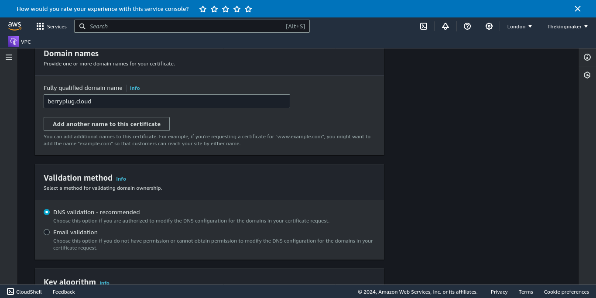

   

   

### Configure EFS
---

   * Create a new EFS File system. Create an EFS mount target per AZ in the VPC, associate it with both subnets dedicated for data layer. Associate the Security groups             created earlier for data layer.

   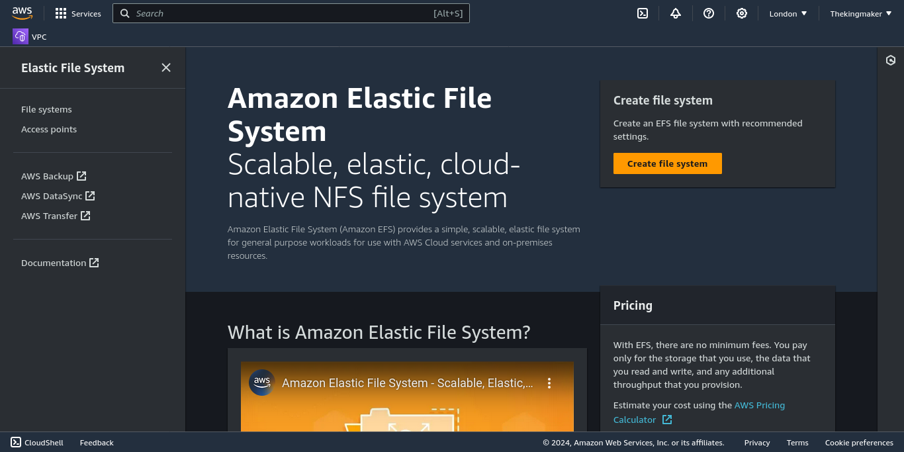

   

   

   * Create 2 access points - For each of the website (wordpress and tooling) so that the files do not overwrite each other when we moun

   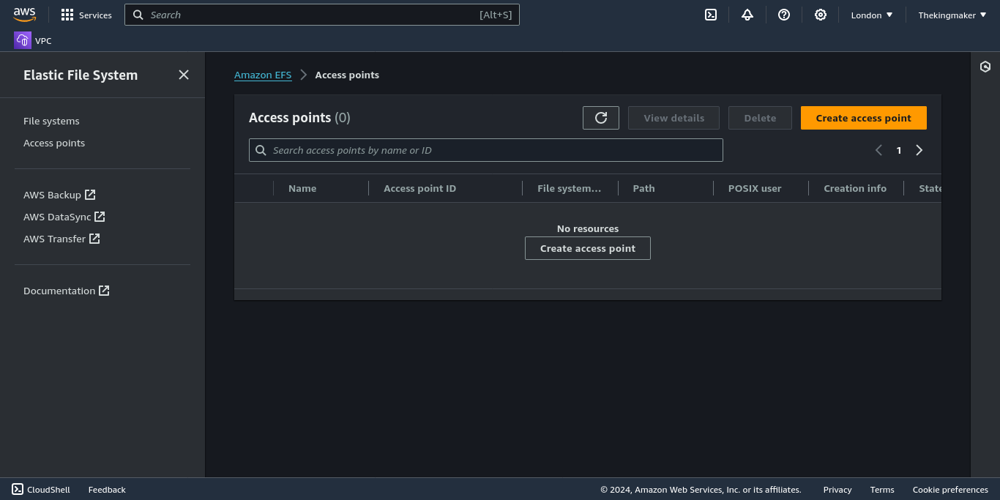

   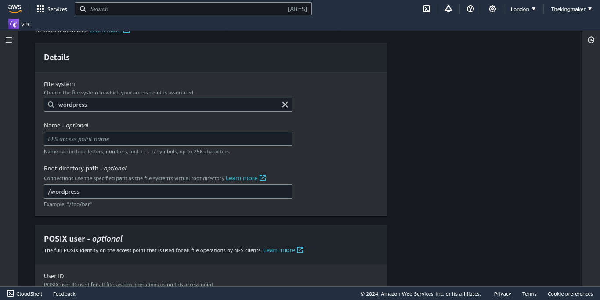

   

   

### Configure RDS
-----
#### Pre-requisite:

   * Create a KMS Key

   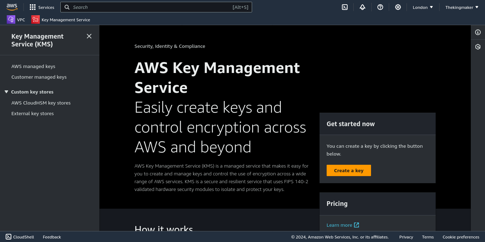

   

   

   

   * To ensure that yout databases are highly available and also have failover support in case one availability zone fails, we will configure a multi-AZ set up of RDS MySQL       database instance. In our case, since we are only using 2 AZs, we can only failover to one, but the same concept applies to 3 Availability Zones.

   * To configure RDS, follow steps below:

   
   1. Create a subnet group and add 2 private subnets (data Layer)

      

      

      
      

   2. Create the DataBase by navigating to `amazon rds` > `databases` > `create database`

      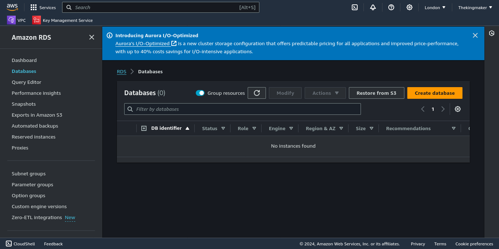

      

      

      

      

      
      

