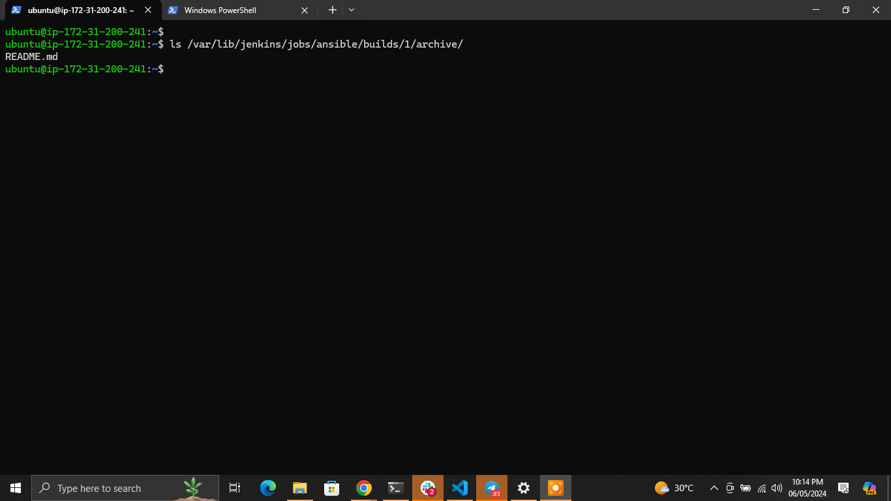

# Ansible Configuration Management for EC2

## Overview

This guide details the process for deploying and managing EC2 instances using Ansible. It includes steps for Ansible installation, playbook creation, and server management automation.

## Installation: Setting Up Ansible on Your EC2 Instance

### Step 1: Preparing Your EC2 Instance

- **Rename your Jenkins EC2 instance to `Jenkins-Ansible`**:
  - **Purpose**: This specific naming helps in easily identifying the purpose of the instance, which is crucial when managing multiple servers.
  - **Action**: Update the `Name` tag on your EC2 instance dashboard.
    
  

### Step 2: Creating a GitHub Repository

- **Initiate a new repository named `ansible-config-mgt`**:
 


### Step 3: Installing Ansible

- **Install Ansible on your EC2 instance**:
  - **Purpose**: Ansible automates and simplifies application deployment, systems configuration, and other IT needs.

    ```bash
    sudo apt update && sudo apt upgrade -y
    sudo apt install ansible -y
    ```
  -  Ensure the installation was successful by checking the Ansible version.
    ```bash
    ansible --version
    ```
  

### Step 4: Configuring Jenkins

- **Configure Jenkins to build from the GitHub repository**:
  - **Purpose**: Automates the deployment process, ensuring that the latest configurations are always in use.
  - **Action**: Set up a new freestyle project in Jenkins and link it to the `ansible-config-mgt` GitHub repository.
 

- **Set up a GitHub webhook**:
  - **Purpose**: Triggers Jenkins builds automatically upon code commits, reducing the need for manual oversight.
  

- **Configure SCM and build triggers**:
  - Under configure, select source code management and set it up to connect to github, set user name and password 
  

  
  

- **Post-build actions**:
  - **Purpose**: Saves all necessary files and ensures that any deployment artifacts are stored properly.
    
- **Test the setup:**
- Make changes to the `README.md` file in the `main` branch.

- Ensure builds start automatically and Jenkins saves the files in:
  

         ls /var/lib/jenkins/jobs/ansible/builds/1/archive/
  
    

## Preparing Your Development Environment

### Step 5: Using Visual Studio Code

- **Connect VSC to GitHub**:
  - **Commands**:
    ```bash
    git config --global user.email "your-github-email"
    git config --global user.name "Your-userName"
    ```

- **Clone the repository**:
  - **Purpose**: Allows you to work locally on the Ansible configurations.
  - **Command**:
    ```bash
    git clone <repository-url>
    ```
 

## Developing with Ansible

### Step 6: Ansible Playbook Development

- **Create a playbook directory structure**:
  - **Directories**: `playbooks` for storing playbooks and `inventory` for managing hosts.
  - **Purpose**: Organizes your Ansible project clearly, making it easier to manage.
  

### Step 7: Setting Up an Ansible Inventory

- **Configure inventory files**:
  - **Purpose**: Defines which hosts are managed by which playbooks, crucial for targeting the correct environments.
  - **Files**: `inventory/dev`, `inventory/staging`, `inventory/uat`, and `inventory/prod`.

      


  
