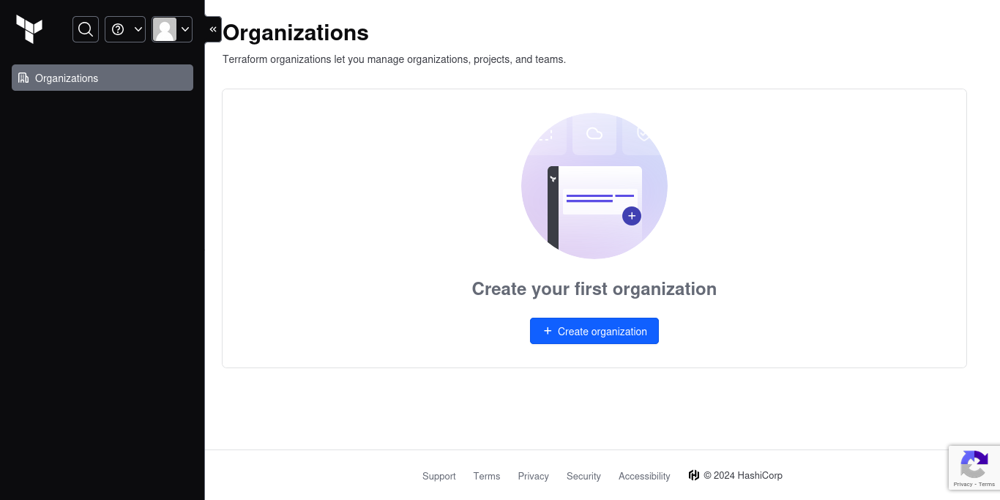
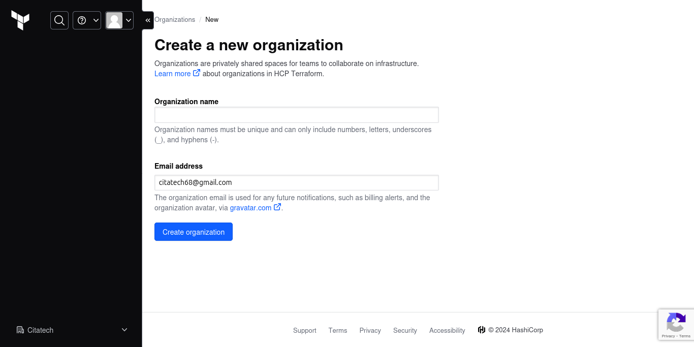
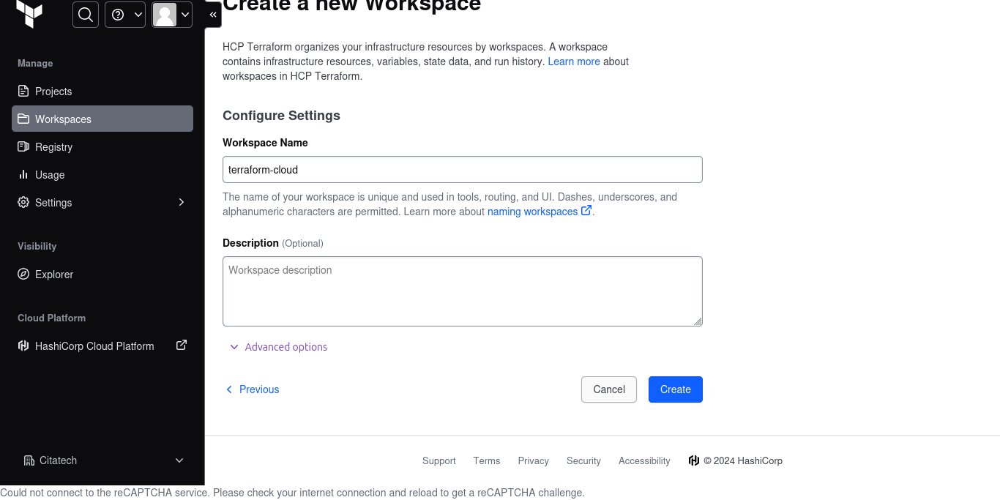

# Automate Infrastructure With IaC using Terraform 4 (Terraform Cloud)

### What Terraform Cloud is and why use it

By now, you should be pretty comfortable writing Terraform code to provision Cloud infrastructure using Configuration Language (HCL). Terraform is an open-source system, that you installed and ran a Virtual Machine (VM) that you had to create, maintain and keep up to date. In Cloud world it is quite common to provide a managed version of an open-source software. Managed means that you do not have to install, configure and maintain it yourself - you just create an account and use it "as A Service".

[Terraform Cloud]() is a managed service that provides you with Terraform CLI to provision infrastructure, either on demand or in response to various events.

By default, Terraform CLI performs operation on the server whene it is invoked, it is perfectly fine if you have a dedicated role who can launch it, but if you have a team who works with Terraform - you need a consistent remote environment with remote workflow and shared state to run Terraform commands.

Terraform Cloud executes Terraform commands on disposable virtual machines, this remote execution is also called [remote operations](https://developer.hashicorp.com/terraform/cloud-docs/run/remote-operations).


## Migrate your `.tf` codes to Terraform Cloud

Let us explore how we can migrate our codes to Terraform Cloud and manage our AWS infrastructure from there:

## 1. Create a Terraform Cloud account

Follow [this link](https://app.terraform.io/public/signup/account), create a new account, verify your email and you are ready to start.



Most of the features are free, but if you want to explore the difference between free and paid plans - you can check it on [this page](https://www.hashicorp.com/products/terraform/pricing).

## 2. Create an organization

Select `Start from scratch`, choose a name for your organization and create it.



## 3. Configure a workspace

Before we begin to configure our workspace - [watch this part of the video](https://www.youtube.com/watch?v=m3PlM4erixY&t=287s) to better understand the difference between `version control workflow`, `CLI-driven workflow` and `API-driven workflow` and other configurations that we are going to implement.


We will use `version control workflow` as the most common and recommended way to run Terraform commands triggered from our git repository.

Create a new repository in your GitHub and call it `terraform-cloud`, push your Terraform codes developed in the previous projects to the repository.

Choose `version control workflow` and you will be promped to connect your GitHub account to your workspace - follow the prompt and add your newly created repository to the workspace.


Move on to `Configure settings`, provide a description for your workspace and leave all the rest settings default, click `Create workspace`.

`


## 4. Configure variables

Terraform Cloud supports two types of variables: `environment variables` and `Terraform variables`. Either type can be marked as `sensitive`, which prevents them from being displayed in the Terraform Cloud web UI and makes them write-only.

Set two environment variables: __`AWS_ACCESS_KEY_ID`__ and __`AWS_SECRET_ACCESS_KEY`__, set the values that you used in the last two projects. These credentials will be used to privision your AWS infrastructure by Terraform Cloud.


After you have set these 2 environment variables - your Terraform Cloud is all set to apply the codes from GitHub and create all necessary AWS resources.

## 5. Now it is time to run our Terrafrom scripts
But in our previous project, we talked about using `Packer` to build our images, and `Ansible` to configure the infrastructure, so for that we are going to make few changes to our our existing respository from the last project.

The files that would be Addedd is;

- __AMI:__ for building packer images
- __Ansible:__ for Ansible scripts to configure the infrastucture

Before we proceed, we need to ensure we have the following tools installed on our local machine;

- [packer](https://developer.hashicorp.com/packer/tutorials/docker-get-started/get-started-install-cli)

  

- [Ansible](https://docs.ansible.com/ansible/latest/installation_guide/intro_installation.html)

  

Refer to this [repository](https://github.com/citadelict/terraform-cloud) for guidiance on how to refactor your enviroment to meet the new changes above and ensure you go through the `README.md` file.

### Action Plan for this project

- Build images using packer
- confirm the AMIs in the console
- update terrafrom script with new ami IDs generated from packer build
- create terraform cloud account and backend
- run terraform script
- update ansible script with values from teraform output
     - RDS endpoints for wordpress and tooling
     - Database name, password and username for wordpress and tooling
     - Access point ID for wordpress and tooling
     - Internal load balancee DNS for nginx reverse proxy

- run ansible script
- check the website

To follow file structure create a new folder and name it `AMI`. In this folder, create Bastion, Nginx and Webserver (for Tooling and Wordpress) AMI Packer template (`bastion.pkr.hcl`, `nginx.pkr.hcl`, `ubuntu.pkr.hcl` and `web.pkr.hcl`).


Packer template is a `JSON` or `HCL` file that defines the configurations for creating an AMI. Each AMI Bastion, Nginx and Web (for Tooling and WordPress) will have its own Packer template, or we can use a single template with multiple builders.

## Create packer template code for each.

To get the `source AMI owner`, run this command

```bash
aws ec2 describe-images --filters "Name=name,Values=RHEL-9.4.0_HVM-20240605-x86_64-82-Hourly2-GP3" --query "Images[*].{ID:ImageId,Name:Name,Owner:OwnerId}" --output table
```
Ensure to update `Values` with the correct ami name

__Output__


### Packer code for bastion


To format a specific Packer configuration file, use the following command

```hcl
packer fmt <name>.pkr.hcl

packer fmt bastion.pkr.hcl
packer fmt nginx.pkr.hcl
packer fmt ubuntu.pkr.hcl
packer fmt web.pkr.hcl
```
### Initialize the Plugins

```hcl
packer init bastion.pkr.hcl
```


### Validate each packer template

```hcl
packer validate bastion.pkr.hcl
packer validate nginx.pkr.hcl
packer validate ubuntu.pkr.hcl
packer validate web.pkr.hcl
```


### Run the packer commands to build AMI for Bastion server, Nginx server and webserver

### For Bastion

```hcl
packer build bastion.pkr.hcl
```


### For Nginx

```hcl
packer build nginx.pkr.hcl
```


### For Webservers

```hcl
packer build web.pkr.hcl
```


### For Ubuntu (Jenkins, Artifactory and sonarqube Server)

```hcl
packer build ubuntu.pkr.hcl
```


### The new AMI's from the packer build in the terraform script


In the terraform director, update the `terraform.auto.tfvars` with the new AMIs IDs built with packer which terraform will use to provision Bastion, Nginx, Tooling and Wordpress server


## 6. Run `terraform plan` and `terraform apply` from web console

- Switch to `Runs` tab and click on `Queue plan manualy` button.


- If planning has been successfull, you can proceed and confirm Apply - press `Confirm and apply`, provide a comment and `Confirm plan`


Check the logs and verify that everything has run correctly. Note that Terraform Cloud has generated a unique state version that you can open and see the codes applied and the changes made since the last run.

Check the AWS console


## 7. Test automated `terraform plan`

By now, you have tried to launch `plan` and `apply` manually from Terraform Cloud web console. But since we have an integration with GitHub, the process can be triggered automatically. Try to change something in any of `.tf` files and look at `Runs` tab again - `plan` must be launched automatically, but to `apply` you still need to approve manually.

Since provisioning of new Cloud resources might incur significant costs. Even though you can configure `Auto apply`, it is always a good idea to verify your `plan` results before pushing it to `apply` to avoid any misconfigurations that can cause 'bill shock'.

__Follow the steps below to set up automatic triggers for Terraform plans and apply operations using GitHub and Terraform Cloud:__

1. Configure a GitHub account as a Version Control System (VCS) provider in Terraform Cloud and follow steps

- Add a VCS provider


- Go to `Version Control` and click on `Change source`


- Click on `GitHub.com (Custom)`


- Select the repository


#### Make a change to any Terraform configuration file (.tf file)

Security group decription was edited in the variables.tf file and pushed to the repository on github that is linked to our Terraform Cloud workspace.

#### Check Terraform Cloud

Click on `Runs` tab in the Terraform Cloud workspace. Notice that a new plan has been automatically triggered as a result of the push.


__Note:__ First, try to approach this project on your own, but if you hit any blocker and could not move forward with the project, refer to [support](https://www.youtube.com/watch?v=nCemvjcKuIA).

# Configuring The Infrastructure With Ansible

- After a successful execution of terraform apply, connect to the bastion server through ssh-agent to run ansible against the infrastructure.

Run this commands to forward the ssh private key to the bastion server.

```bash
eval `ssh-agent -s`
ssh-add <private-key.pem>
ssh-add -l
```

- Update the `nginx.conf.j2` file to input the internal load balancer dns name generated.


- Update the `RDS endpoints`, `Database name`, `password` and `username` in the `setup-db.yml` file for both the `tooling` and `wordpress` role.

__For Tooling__


__For Wordpress__


- Update the `EFS` `Access point ID` for both the `wordpress` and `tooling` role in the `main.yml`

__For Tooling__


__For Wordpress__


### Access the bastion server with ssh agent

```bash
ssh -A ec2-user@<bastion-pub-ip>
```
Confirm ansible is installed on bastion server


- Verify the inventory


Export the environment variable `ANSIBLE_CONFIG` to point to the `ansible.cfg` from the repo and run the ansible-playbook command:

```bash
export ANSIBLE_CONFIG=/home/ec2-user/terraform-cloud/ansible/roles/ansible.cfg

ansible-playbook -i inventory/aws_ec2.yml playbook/site.yml
```


#### Access wordpress and tooling website via a browser

Tooling website


Wordpress website


# Practice Task №1

1. Configure 3 branches in the `terraform-cloud` repository for `dev`, `test`, `prod` environments


2. Make necessary configuration to trigger runs automatically only for dev environment

- Create a workspace each for the 3 environments (i.e, `dev`, `test`, `prod`).


- Configure `Auto-Apply` for `dev` workspace to trigger runs automatically

Go to the dev workspace in Terraform Cloud > Navigate to Settings > Vsersion Control > Check boxes for Auto Apply


3. Create an Email and Slack notifications for certain events (e.g. `started plan` or `errored run`) and test it.

__Email Notification:__ In the dev workspace, Go to Settings > Notifications > Add a new notification


The bastion instance type was changed to t3.small in order to test it


This will automatically apply after a successful plan


Confirm notification has bben sent to the provided email address


### Slack Notification:

We will need to create a `Webhook URL` for the slack channel we want to send message to before creating the notification.

__Slack Notification Setup__

i. Visite [https://api.slack.com/apps?new_app=1](https://api.slack.com/apps?new_app=1).

ii. In the resulting popup, select Create an app > From scratch

iii. Choose a name > select the workspace you would like to send your notifications > Create App


iv. Click on `install to <Selected slack workspace name>` to install the Notification App


v. Select Incoming Webhooks and copy the webhook URL.


Now, let's create the slack notification (paste the webhook url)


The bastion instance type was changed back to t2.small in order to test it


Confirm the terraform process notification sent to the slack channel selected


4. Apply destroy from Terraform Cloud web console.


### Public Module Registry vs Private Module Registry

Terraform has a quite strong community of contributors (individual developers and 3rd party companies) that along with HashiCorp maintain a [Public Registry](https://developer.hashicorp.com/terraform/registry), where you can find reusable configuration packages ([modules](https://developer.hashicorp.com/terraform/registry/modules/use)). We strongly encourage you to explore modules shared to the public registry, specifically for this project - you can check out this [AWS provider registy page](https://registry.terraform.io/modules/terraform-aws-modules/vpc/aws/latest).

As your Terraform code base grows, your DevOps team might want to create you own library of reusable components - [Private Registry](https://developer.hashicorp.com/terraform/registry/private) can help with that.


# Practice Task №2

## Working with Private repository

1. Create a simple Terraform repository (you can clone one [from here](https://github.com/hashicorp/learn-private-module-aws-s3-webapp)) that will be your module.


- Under the repository's tab, clicking on `tag` to create tag. click `Create a new release` and adding `v1.0.0` to the tag version field setting the release title to `First module release`


2. Import the module into your private registry

Go to Registery > Module > Add Module > select GitHub (Custom)


Click on __`configure credentials`__ from here


Click on `create an API toekn` from here


Configure the token generated, in the Terraform CLI configuration file `.terraformrc`.

```bash
vim ~/.terraformrc
```
Copy the credentials block below and paste it into the `.terraformrc` file.
Ensure to replace the value of the token argument with the API token created.

```hcl
credentials "app.terraform.io" {
  # valid user API token
  token = "xxxxxxxxx.atlasv1.zzzzzzzzzzzzzzzzz"
}
```
Alternatively, we can choose to export the token using environment varaiabel in the CLI

```bash
export TERRAFORM_CLOUD_TOKEN="xxxxxxxxx.atlasv1.zzzzzzzzzzzzzzzzz"
```
3. Create a configuration that uses the module.

- In your local machine, create a new directory for the Terraform configuration.
Create a `main.tf` file to use the module.
Then click on `Copy configuration` under Usage instructions and paste it into main.tf


__Initialize the Configuration__

```bash
terraform init
```


4. Create a workspace for the configuration, Select CLI-driven workflow Name the workspace s3-webapp-workspace


Add the code block below to the terraform configuration file to setup the cloud integration.

```hcl
terraform {
  cloud {

    organization = "fnc-project-19"

    workspaces {
      name = "s3-webapp-workspace"
    }
  }
}
```


5. Deploy the infrastructure

Run `terraform apply` to deploy the infrastructure.


6. Destroy your deployment

Run `terraform destroy` to destory the infrastructure


## Conclusion

We have learned how to effectively use managed version of Terraform - `Terraform Cloud`. We have also practiced in finding modules in a Public Module Registry as well as build and deploy our own modules to a Private Module Registry.