# Configure Ansible configuration repo For Jenkins Deployment

This is project is continuation from my ansible dynamic assignment projects.
I would be using a copy of the  `ansible-config-mgt` repo which I have renamed `ansible-configuration`

## 1 `Installing Jenkins`

Start by launching an AWS EC2 instance with a Ubuntu OS and set up the Jenkins server.

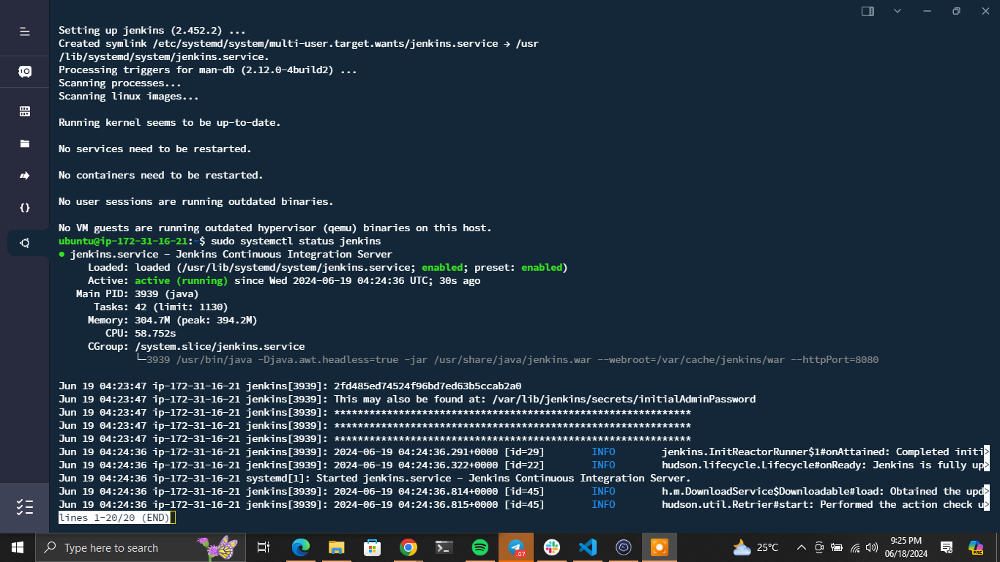

> Make sure to open port 8080 in the security group

## 2 `Installing Blue-Ocean Plugin`
To make managing your Jenkins pipelines easier and more intuitive, install the Blue Ocean plugin. This plugin offers a user-friendly and visually appealing interface, helping you quickly understand the status of your continuous delivery pipelines.

To do this , follow the steps below :

  - Go to `manage jenkins` > `manage plugins` > `available`
  - Search for BLUE OCEAN PLUGIN  and install

## 3 `Configure the Blue Ocean plugin pipeline with our github repo`

To do this, follow the step below:

  - Open the blue oceans plugin and `create a new pipeline`
  - Select github
  - Connect github with jenkins using your github personal access token
  - Select the repository
  - Create the pipeline

  - In order for Jenkins to reconginze our repo, we need to add a Jenkinsfile. Create a `deploy` folder and add a `Jenkinsfile` to it.

  - Let's create a simple pipeline with one stage `build`. This has a shell command to echo a text "echo "Building Stage".

         
              pipeline {
                  agent any
              
                stages {
                  stage('Build') {
                    steps {
                      script {
                        sh '"echo "Building Stage"'
                      }
                    }
                  }
                  }
              }
       
              
  - Now go back into the Ansible pipeline in Jenkins, and select `configure` then Scroll down to `Build Configuration`, inside `script Path` specify the location of the Jenkinsfile at `deploy/Jenkinsfile`

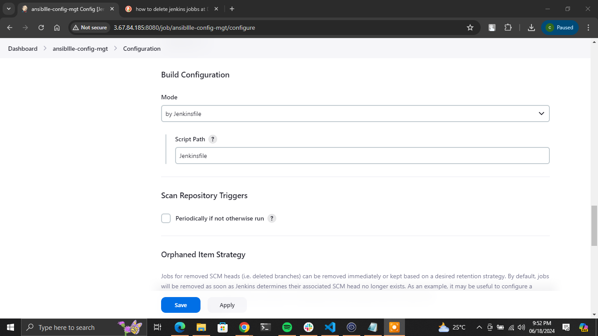

  - Go back to the pipeline again, this time click `Build` now and then click on `blue ocean` on the right menu.

  - Jenkins usually scan all branches to build. Let see this in action. Create a new branch `feature/jenkinspipeline-stages` and add one more stage `test`to the pipeline`

  - Click on `scan repository now` to build all available branches on the repository.
  - In `Blue Ocean`, you can now see how the Jenkinsfile has caused a new step in the pipeline launch build for the new branch.

`additinal Tasks to perform tp better understand the whole process`.

  - Let's create a pull request to merge the latest code into the main branch, after merging the PR, go back into your terminal and switch into the main branch.Pull the latest change.
  - Create a new branch, add more stages into the Jenkins file to simulate below phases. (Just add an echo command like we have in build and test stages)

       1. Package 
       2. Deploy 
       3. Clean up

   - Scan the repo again and allow jenkins build

### `Running Ansible playbook from Jenkins`

 Now that we have understanding of how a typical jenkins pipeline works, lets go further by integratiing `Ansible` into our setup

### `Install Ansible`

          
          sudo apt update && sudo apt upgrade -y
          sudo apt install ansible -y
          

### `Install Ansible Plugin on Jenkins`

   - On the dashboard page, click on `Manage Jenkins` > `Manage plugins` > Under `Available` type in `ansible` and install without restart

   - Click on `Dashboard` > `Manage Jenkins` > `Tools` > `Add Ansible`. Add a name and the path ansible is installed on the jenkins server.
   - To get the ansible path on the jnekins server, run :

           > $ which ansible

   - Now, delete all you have in your Jenkinsfile and start writing it again. to do this, we can make use of pipeline syntax to ensure we get the exact command for what we intend to achieve. here is how the Jenkinsfile should look eventually .

                       pipeline {
                              agent any
                            
                              environment {
                                ANSIBLE_CONFIG = "${WORKSPACE}/deploy/ansible.cfg"
                                ANSIBLE_HOST_KEY_CHECKING = 'False'
                              }
                            
                              stages {
                                stage("Initial cleanup") {
                                  steps {
                                    dir("${WORKSPACE}") {
                                      deleteDir()
                                    }
                                  }
                                }

                                stage('Checkout SCM') {
                                  steps {
                                    git branch: 'main', url: 'https://github.com/citadelict/ansibllle-config-mgt.git'
                                  }
                                }
                            
                                stage('Prepare Ansible For Execution') {
                                  steps {
                                    sh 'echo ${WORKSPACE}'
                                    sh 'sed -i "3 a roles_path=${WORKSPACE}/roles" ${WORKSPACE}/deploy/ansible.cfg'
                                  }
                                }
                            
                                stage('Test SSH Connections') {
                                  steps {
                                    script {
                                      def hosts = [
                                        [group: 'tooling', ip: '172.31.30.46', user: 'ec2-user'],
                                        [group: 'tooling', ip: '172.31.25.209', user: 'ec2-user'],
                                        [group: 'nginx', ip: '172.31.26.108', user: 'ubuntu'],
                                        [group: 'db', ip: '172.31.24.250', user: 'ubuntu']
                                      ]
                                      for (host in hosts) {
                                        sshagent(['private-key']) {
                                          sh "ssh -o StrictHostKeyChecking=no -i /home/ubuntu/.ssh/key.pem ${host.user}@${host.ip} exit"
                                        }
                                      }
                                    }
                                  }
                                }
                            
                                stage('Run Ansible playbook') {
                                  steps {
                                    sshagent(['private-key']) {
                                      ansiblePlaybook(
                                        become: true,
                                        credentialsId: 'private-key',
                                        disableHostKeyChecking: true,
                                        installation: 'ansible',
                                        inventory: "${WORKSPACE}/inventory/dev.yml",
                                        playbook: "${WORKSPACE}/playbooks/site.yml"
                                      )
                                    }
                                  }
                                }
                            
                                stage('Clean Workspace after build') {
                                  steps {
                                    cleanWs(cleanWhenAborted: true, cleanWhenFailure: true, cleanWhenNotBuilt: true, cleanWhenUnstable: true, deleteDirs: true)
                                  }
                                }
                              }
                            }

  * ### Here is what each part of my jenkinsfile does :
      - Environment variables are set for the pipeline: `ANSIBLE_CONFIG` specifies the path to the Ansible configuration file. while `ANSIBLE_HOST_KEY_CHECKING` disables host key checking to avoid interruptions during SSH connections.
      - Stage: `Initial cleanup` : This cleans up the workspace to ensure a fresh environment for the build by deleting all files in the workspace directory.
      - Stage: `Checkout SCM` : This checks out the source code from the specified Git repository, and alos uses `git` step to clone the repository.
      - Stage:` Prepare Ansible For Execution` : Prepares the Ansible environment by configuring the Ansible roles path by printing the workspace path, and modifying the Ansible configuration file to add the roles path.
      - Stage: `Test SSH Connections` : Verifies SSH connectivity to each server.
      - Stage: `Run Ansible playbook` : Executes the Ansible playbook. :
            - Uses the sshagent step to ensure the SSH key is available for Ansible.
            - Runs the ansiblePlaybook step with the specified parameters .
            ####  To ensure jenkins properly connects to all servers, you will need to install another plugin known as `ssh agent` , after that, go to `manage jenkins` > `credentials` > `global` > `add credentials` , usee `ssh username and password` , fill out the neccesary details and save.

 - Now back to your `inventory/dev.yml` , update the inventory with thier respective servers private ip address
   

 - Update the ansible playbook in playbooks/site.yml for the tooling web app deployment. Click on Build Now.

 

### `Parameterizing Jenkinsfile For Ansible Deployment`      

- Update your `/inventory/sit.yml file with the code below

                    [tooling]
                    <SIT-Tooling-Web-Server-Private-IP-Address>
                    
                    [todo]
                    <SIT-Todo-Web-Server-Private-IP-Address>
                    
                    [nginx]
                    <SIT-Nginx-Private-IP-Address>
                    
                    [db:vars]
                    ansible_user=ec2-user
                    ansible_python_interpreter=/usr/bin/python
                    
                    [db]
                    <SIT-DB-Server-Private-IP-Address>

  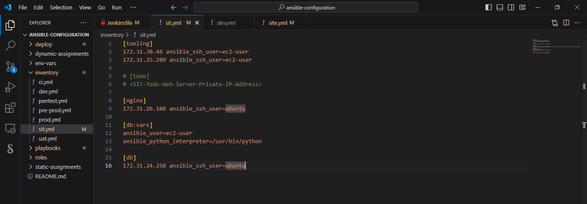

There are always several environments that need configuration, such as CI, site, and pentest environments etc. To manage and run these environments dynamically, we need to update the Jenkinsfile.

                     parameters {
              string(name: 'inventory', defaultValue: 'dev',  description: 'This is the inventory file for the environment to deploy configuration')
            }

- Update the inventory path with this : `${inventory}`
                 

- Notice the `Build Now` is changed to `Build with Parameters` and this enables us to run differenet environment easily.

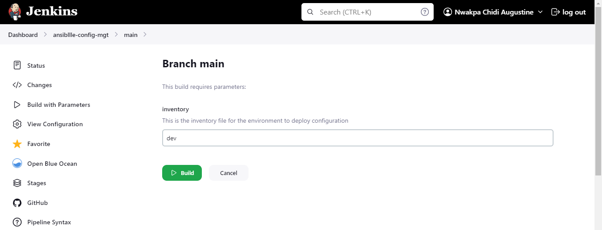

### Add another Parameter to better understand the use, Introduce tagging in ansible , and limit the playbook execution to just specific roles,  for this task, ensure only the webserver roles are implemented when you run the playbook. To do this ,

   -  Add another parameter to the one we added above. specify the parameter name as `ansible_tags` and the default value to webserver

                       string(name: 'ansible_tags', defaultValue: 'webserver', description: 'Ansible tags to run specific roles or tasks')

   - Update the playbook with tags to all the tasks to easily differentiate between them

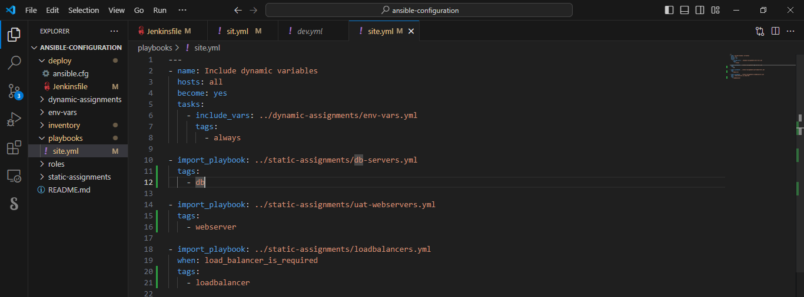

   - update the jenkins file to included the ansible tags before it runs playbook

   - Click on build with parameters and update the inventory field to sit and the the ansible_tags to webserver

   - Run your build .

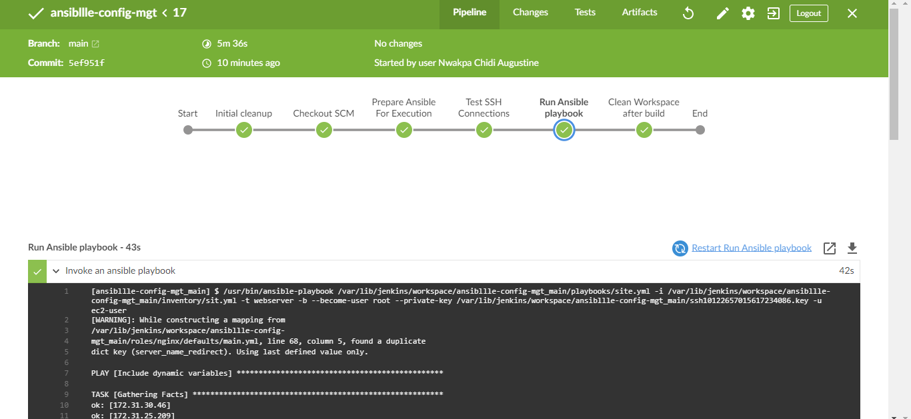

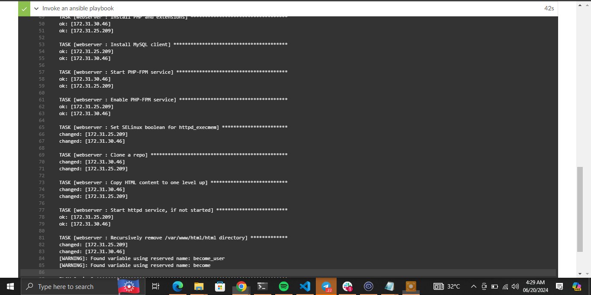

### `CI/CD Pipeline for TODO application`

We already have tooling website as a part of deployment through Ansible. Here we will introduce another PHP application to add to the list of software products we are managing in our infrastructure. The good thing with this particular application is that it has unit tests, and it is an ideal application to show an end-to-end CI/CD pipeline for a particular application.

Our goal here is to deploy the application onto servers directly from `Artifactory` rather than from `git`.

### `Phase 1 – Prepare Jenkins`

  - Fork the todo repository below into your GitHub account

                  https://github.com/StegTechHub/php-todo.git

  - On you Jenkins server, install PHP dependencies for app, its dependencies and Composer tool

                  sudo apt update
                  sudo apt install -y zip libapache2-mod-php phploc php-{xml,bcmath,bz2,intl,gd,mbstring,mysql,zip}
                  php -r "copy('https://getcomposer.org/installer', 'composer-setup.php');"
                  sudo php composer-setup.php --install-dir=/usr/local/bin --filename=composer
                  php -r "unlink('composer-setup.php');"
                  php -v
                  composer -v

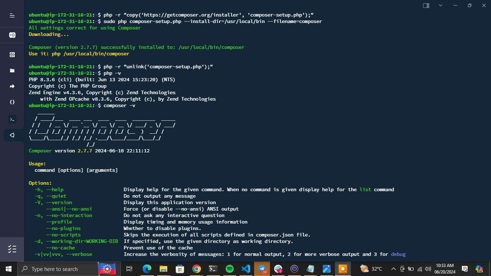

   - Install the required jenkins plugin, which is `plot` and `Artifactory` plugins

 `Plot Plugin Installation`  :  We will use plot plugin to display tests reports, and code coverage information.

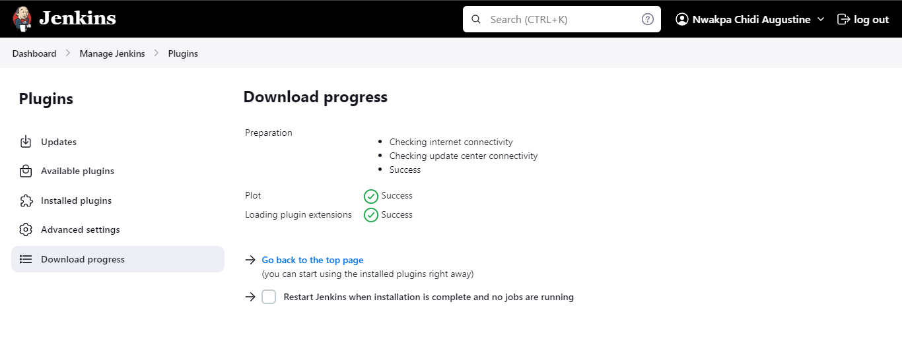

  ` Artifactory Plugin Installation`  :  The Artifactory plugin will be used to easily upload code artifacts into an Artifactory server.

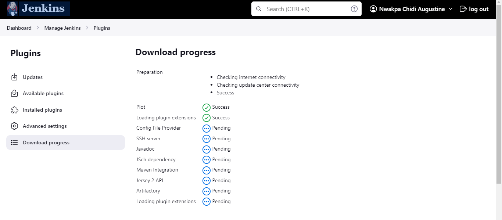

### `Phase 2 – Set up Ansible roles for artifactory`

  -  Create roles to install artifactory just the same way we set up apache, mysql and nginx in the previous project.

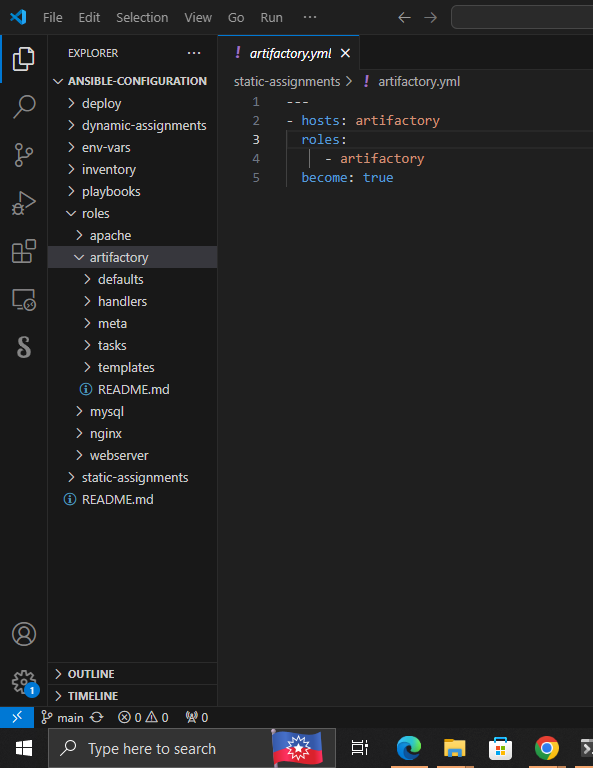

  -  Run the playbook against the `inventory/ci.yml`

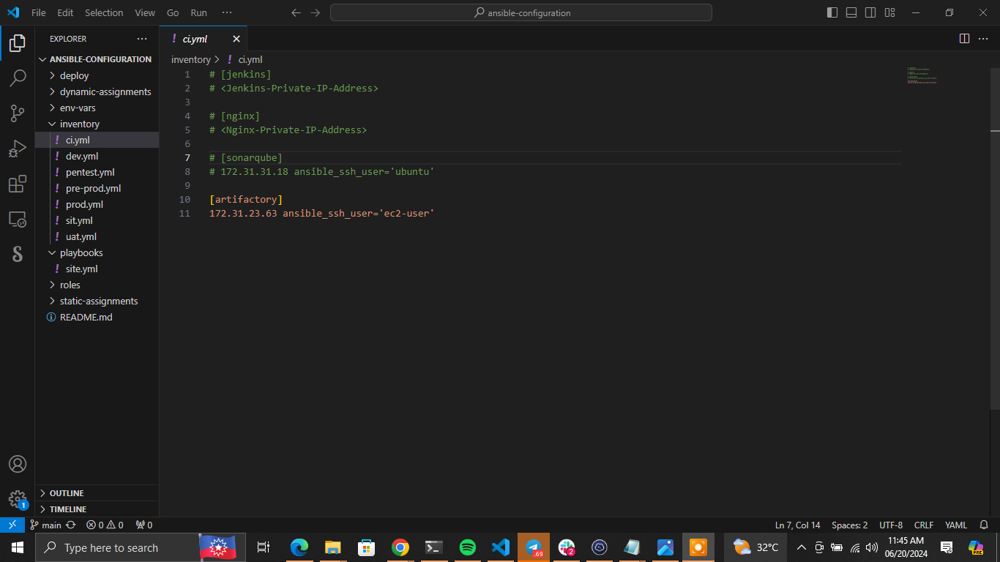

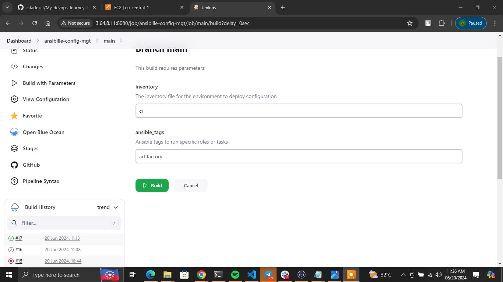

  -  After installation, open port `8081` and port `8082` in your artifactory security group in bound rules

  - Configure Artifactory plugin by going to `manage jenkins` > `system configurations`, scroll down to jfrog and click on `add instance`
  - Input the ID, artifactory url , username and password
  - Click on `test connection` to test your url

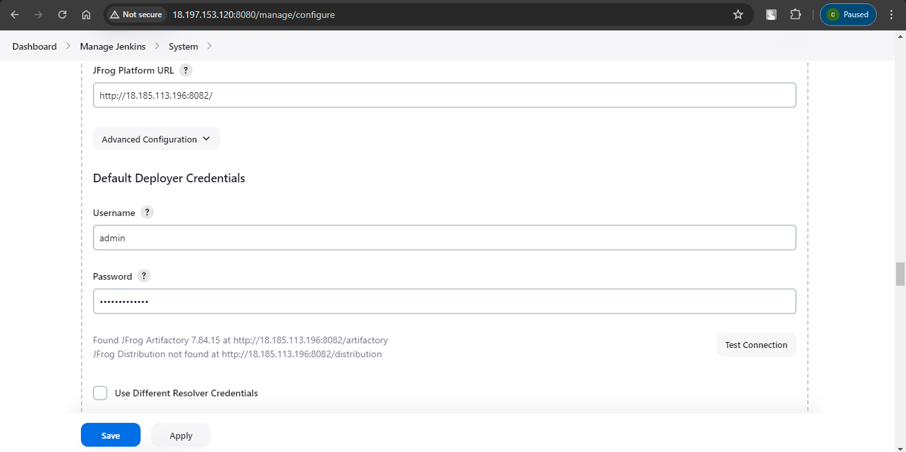

  -  Visit your `<your-artifactory-ip-address:8081`
  -  Sign in using the default artifactory credentials : `admin` and `password`

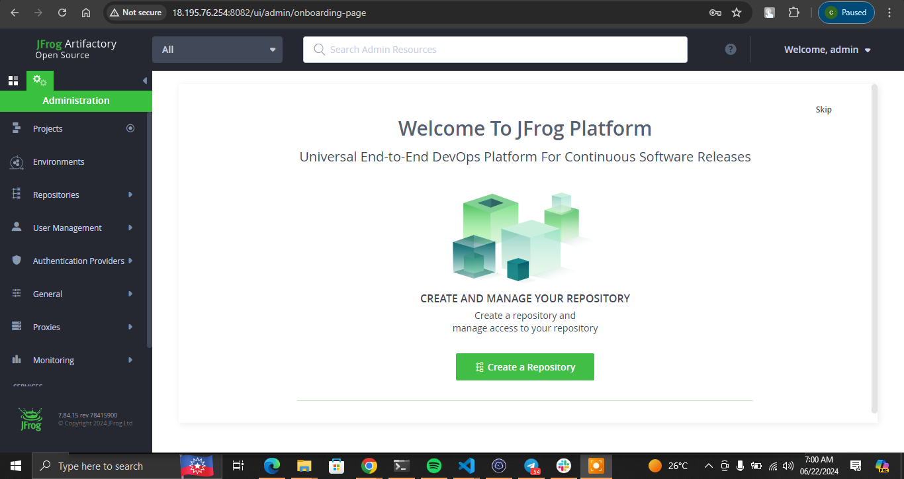

  - Create a local repository and call it `todo-dev-local`, set the repository type to `generic`

  - Update the database configuration in  `roles/mysql/vars/main.yml` to create a new database and user for the Todo App. use the details below :

                        Create database homestead;
                        CREATE USER 'homestead'@'%' IDENTIFIED BY 'sePret^i';
                        GRANT ALL PRIVILEGES ON * . * TO 'homestead'@'%';

  - Create a Multibranch pipeline for the Php Todo App.

  - Create a .env.sample file and update it with the credentials to connect the database, use sample the code  below :

                              APP_ENV=local
                              APP_DEBUG=true
                              APP_KEY=SomeRandomString
                              APP_URL=http://localhost
                              
                              DB_HOST=172.31.24.250
                              DB_DATABASE=homestead
                              DB_USERNAME=homestead
                              DB_PASSWORD=sePret^i
                              
                              CACHE_DRIVER=file
                              SESSION_DRIVER=file
                              QUEUE_DRIVER=sync
                              
                              REDIS_HOST=127.0.0.1
                              REDIS_PASSWORD=null
                              REDIS_PORT=6379
                              
                              MAIL_DRIVER=smtp
                              MAIL_HOST=mailtrap.io
                              MAIL_PORT=2525
                              MAIL_USERNAME=null
                              MAIL_PASSWORD=null
                              MAIL_ENCRYPTION=null
    

   - php artisan uses the .env file to setup the required database objects – (After successful run of this step, login to the database, run show tables and you will see the tables being created for you)
   

                            #update database server configuration
                            sudo vi /etc/mysql/mysql.conf.d/mysqld.cnf
                            
                            # install mysql client on jenkins server
                            sudo yum install mysql -y 

   - Update Jenkinsfile with proper pipeline configuration

                                     pipeline {
                                    agent any
                                
                                  stages {
                                
                                     stage("Initial cleanup") {
                                          steps {
                                            dir("${WORKSPACE}") {
                                              deleteDir()
                                            }
                                          }
                                        }
                                  
                                    stage('Checkout SCM') {
                                      steps {
                                            git branch: 'main', url: 'https://github.com/StegTechHub/php-todo.git'
                                      }
                                    }
                                
                                    stage('Prepare Dependencies') {
                                      steps {
                                             sh 'mv .env.sample .env'
                                             sh 'composer install'
                                             sh 'php artisan migrate'
                                             sh 'php artisan db:seed'
                                             sh 'php artisan key:generate'
                                      }
                                    }
                                  }
                                }
     
     - Ensure that all neccesary php extensions are already installed .
     - Run the pipeline build , you will notice that the database has been populated with tables using a method in laravel known as migration and seeding.      
    

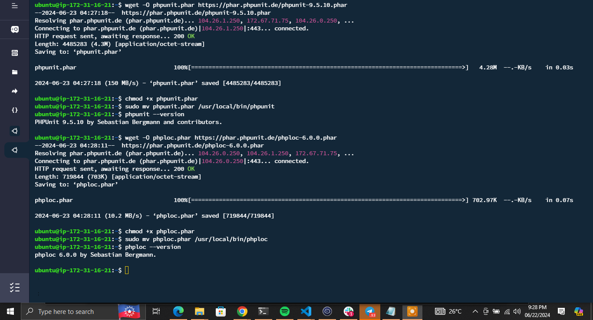

  - Update the Jenkinsfile to include Unit tests step

                               stage('Execute Unit Tests') {
                              steps {
                                     sh './vendor/bin/phpunit'
                              } 
                                   
### `Phase 3 – Code Quality Analysis`

  This is one of the areas where developers, architects and many stakeholders are mostly interested in as far as product development is concerned. For PHP the most commonly tool used for code quality analysis is phploc.

The data produced by phploc can be ploted onto graphs in Jenkins.

To implement this, add the flow code snippet

                          stage('Code Analysis') {
                            steps {
                                  sh 'phploc app/ --log-csv build/logs/phploc.csv'
                          
                            }
                          }

Plot the data using plot Jenkins plugin

This plugin provides generic plotting (or graphing) capabilities in Jenkins. It will plot one or more single values variations across builds in one or more plots. Plots for a particular job (or project) are configured in the job configuration screen, where each field has additional help information. Each plot can have one or more lines (called data series). After each build completes the plots’ data series latest values are pulled from the CSV file generated by phploc.

View in the `Plot` chart in Jenkins

### `Phase 4 – Bundle and deploy` : Bundle the todo application code into an artifact and upload to jfrog artifactory. 

 - to do this, we have to add a stage to our todo jenkinsfile to save ethe artifact as a zip file, to do this : 
       * Edit your `php-todo/Jenkinsfile` , add the code below
   
                                              stage('Package Artifact') {
                                              steps {
                                                  sh 'zip -qr php-todo.zip ${WORKSPACE}/*'
                                              }
                                          }
                        
 -  Add another stage to upload the zipped artifact into our already configured artifactory repository.

                                            stage('Upload Artifact to Artifactory') {
                                            steps {
                                                script {
                                                    def server = Artifactory.server 'artifactory-server'
                                                    def uploadSpec = """{
                                                        "files": [
                                                          {
                                                            "pattern": "php-todo.zip",
                                                            "target": "Todo-dev-local/php-todo",
                                                            "props": "type=zip;status=ready"
                                                          }
                                                        ]
                                                    }"""
                                                    println "Upload Spec: ${uploadSpec}"
                                                    try {
                                                        server.upload spec: uploadSpec
                                                        println "Upload successful"
                                                    } catch (Exception e) {
                                                        println "Upload failed: ${e.message}"
                                                    }
                                                }
                                            }
                                        }
                                
   - Deploy the application to the dev envionment :  `todo server` by launching the ansible playbook.

                                      stage('Deploy to Dev Environment') {
                                      steps {
                                          build job: 'ansibllle-config-mgt/main', parameters: [[$class: 'StringParameterValue', name: 'inventory', value: 'dev']], propagate: false, wait: true
                                      }
                                  }
                              }
                                
  - Write the tasks neccesary for setting up the dev environment in order to preapre it for deployment, like installing php, apache, creating html directories , etc , here is a sample of the tasks.

                              - name: install remi and rhel repo
                              ansible.builtin.yum:
                                name: 
                                  - https://dl.fedoraproject.org/pub/epel/epel-release-latest-9.noarch.rpm
                                  - dnf-utils
                                  - http://rpms.remirepo.net/enterprise/remi-release-9.rpm
                                disable_gpg_check: yes
                            
                            - name: install httpd on the webserver
                              ansible.builtin.yum:
                                name: httpd
                                state: present
                            
                            - name: ensure httpd is started and enabled
                              ansible.builtin.service:
                                name: httpd
                                state: started 
                                enabled: yes
                              
                            - name: install PHP
                              ansible.builtin.yum:
                                name:
                                  - php 
                                  - php-mysqlnd
                                  - php-gd 
                                  - php-curl
                                  - unzip
                                  - php-common
                                  - php-mbstring
                                  - php-opcache
                                  - php-intl
                                  - php-xml
                                  - php-fpm
                                  - php-json
                                enablerepo: remi-7.4
                                state: present
                            
                            - name: ensure php-fpm is started and enabled
                              ansible.builtin.service:
                                name: php-fpm
                                state: started 
                                enabled: yes
                            
                            - name: Download the artifact
                              get_url:
                                url: http://18.192.100.8:8082/artifactory/Todo-dev-local/php-todo/php-todo.zip
                                dest: /home/ec2-user/php-todo.zip
                                url_username: admin
                                url_password: guessWhat232@
                            
                            - name: unzip the artifacts
                              ansible.builtin.unarchive:
                                src: /home/ec2-user/php-todo.zip
                                dest: /home/ec2-user/
                                remote_src: yes
                            
                            - name: deploy the code
                              ansible.builtin.copy:
                                src: /home/ec2-user/php-todo/
                                dest: /var/www/html/
                                force: yes
                                remote_src: yes
                            
                            - name: remove nginx default page
                              ansible.builtin.file:
                                path: /etc/httpd/conf.d/welcome.conf
                                state: absent
                            
                            - name: restart httpd
                              ansible.builtin.service:
                                name: httpd
                                state: restarted

     
                                

