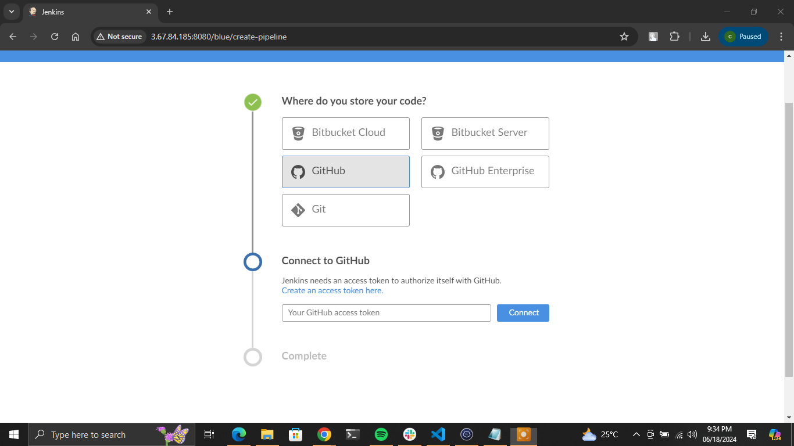

# Configure Ansible configuration repo For Jenkins Deployment

This is project is continuation from my ansible dynamic assignment projects.
I would be using a copy of the  `ansible-config-mgt` repo which I have renamed `ansible-configuration`

## 1 `Installing Jenkins`

Start by launching an AWS EC2 instance with a Ubuntu OS and set up the Jenkins server.

> Make sure to open port 8080 in the security group

## 2 `Installing Blue-Ocean Plugin`
To make managing your Jenkins pipelines easier and more intuitive, install the Blue Ocean plugin. This plugin offers a user-friendly and visually appealing interface, helping you quickly understand the status of your continuous delivery pipelines.

To do this , follow the steps below :

  - Go to `manage jenkins` > `manage plugins` > `available`
  - Search for BLUE OCEAN PLUGIN  and install

## 3 `Configure the Blue Ocean plugin pipeline with our github repo`

To do this, follow the step below:

  - Open the blue oceans plugin and `create a new pipeline`
  - Select github
  - Connect github with jenkins using your github personal access token
  - Select the repository
  - Create the pipeline

  - In order for Jenkins to reconginze our repo, we need to add a Jenkinsfile. Create a `deploy` folder and add a `Jenkinsfile` to it.

